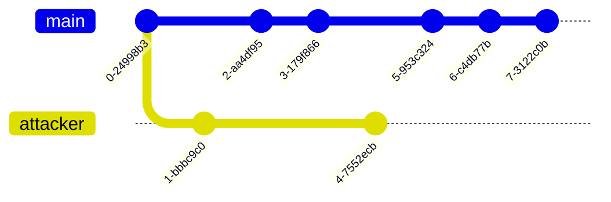

# `Blockchain`

This document focuses on the technology behind [Cryptocurrencies](https://en.wikipedia.org/wiki/Cryptocurrency).

If you're just interested in learning about buying or selling Cryptocurrency, look [here](#cryptocurrencies-to-look-out-for) or [here](#cryptocurrency-trading-platforms).

## What are cryptocurrencies?

Cryptocurrencies are a secure, decentralized digital currency, generally run without a governing authority.

## Ok now tell me about Blockchain.

The technology behind the blockchain comprises 3 main innovations.

1. [Digital signatures](#1-digital-signatures)
2. [Distributed ledger](#2-distributed-ledger)
3. [Proof of work](#3-proof-of-work)

### 1. Digital Signatures

Digital signatures allow secure, verifiable transactions that eliminate the need for 'trust' in another party.

### 2. Distributed ledger

The blockchain comprises a chain of blocks in the structure of a linked list.

Each block contains the ledger *(which contains lists of transactions)*, the previous block's hash and a proof of work *(called the Nonce)*.

### 3. Proof of Work

The proof of work system is enforced via the Nonce, which authenticates a given block.

The Nonce itself is extremely difficult to compute but quick to verify since it requires calculating a [crytographic hash function](https://en.wikipedia.org/wiki/Cryptographic_hash_function) that is NP-hard.

Bitcoin miners compete to compute the Nonce *(specifically the hash with a specific number of leading zeros)* and are rewarded for being the first to correctly do so with the block reward. 

Only blocks with correct Nonces (proof of work) are considered valid and broadcast to the network. This then adds that recognised block to the existing blockchain. 

#### One thing to note about Proof of Work

* Difficulty based on the number of zeros continually adjusts to maintain the average succesful mining time of **10 minutes per block**.

## Bringing everything together

When applied over the network *(comprised of many bitcoin miners)*, the digital signature, distributed ledger and proof of work system allows for powerful, decentralized validation of the running ledger.

Only the longest chain of blocks *(that is regularly broadcast by the network of active miners)* is considered the valid one, making it near impossible for attackers to simulate a 'forked', false version of the blockchain or the ledger's history.

## Cryptocurrencies to look out for

* [Bitcoin](https://bitcoin.org/en/)
* [Ethereum](https://ethereum.org/en/)
* [Ripple](https://ripple.com/)
* [Litecoin](https://litecoin.org/)
* [Ethereum Classic](https://ethereumclassic.org/)

## Cryptocurrency trading platforms

* [BYDFi](https://www.bydfi.com/en/invite?ru=dpcfWp&f=frmrdt)
* [Coinbase](https://www.coinbase.com/en-sg)
* [Kraken](https://www.kraken.com/)
* [Binance](https://www.binance.com/en)
* [Mexc](https://www.mexc.com/)

## More on

* [But how does bitcoin actually work?](https://youtu.be/bBC-nXj3Ng4?feature=shared) by 3Blue1Brown
* [How bitcoin works](https://www.investopedia.com/news/how-bitcoin-works/) by Investopedia
* [Bitcoin: What is it?](https://www.khanacademy.org/v/bitcoin-what-is-it) by Khan Academy
* [Okay but... how does Bitcoin ACTUALLY work?](https://www.linkedin.com/pulse/okay-how-does-bitcoin-actually-work-yousef-al-alami) by Yousef Al Alami