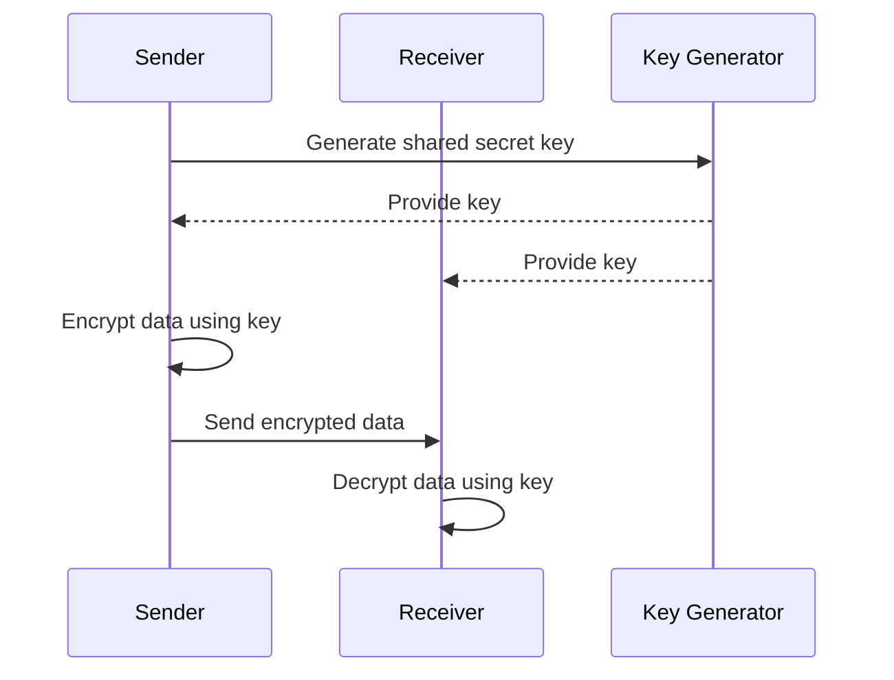
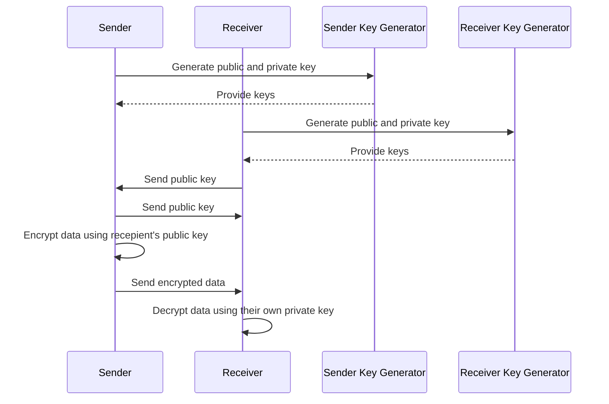
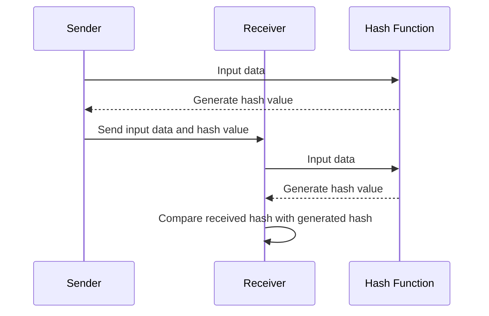

# `Cybersecurity`

## Definitions

* Data lifecycle: stages that data goes through from creation to deletion or archiving *(generation, collection, processing, storage, management, analysis, visualization, interpretation)*
* Data integrity: assurance that data is accurate, complete, consistent and uncorrupted throughout its lifecycle
* Data confidentiality: ensuring data is protected from unauthorized access and disclosure
* Encryption: Conversion of readable information to an unreadable format using an algorithm and key, used to ensure data confidentiality
* Hashing: One-way mathematical function that irreversibly transforms data to a fixed-size character string, used to ensure data integrity

## Securing data

The 2 main methods to secure data are [encryption](#encryption) and [hashing](#hashing).

## Overview 

**Encryption**

* Susceptible to COMPROMISED KEYS due to poor management
* Susceptible to WEAK ENCRYPTION ALGORITHMS 
* Commonly used for data confidentiality IN TRANSIT (during communication) and AT REST (storage)

**Hashing**

* Susceptible to COLLISION ATTACKS where different data inputs produce the same hash value
* Susceptible to BRUTE-FORCE ATTACKS if weak hash functions are used
* Commonly used for data integrity checks

## Encryption

> [!TIP]  
> Remember to run `pip install pycryptodome` to run the worked examples below.

### Symmetric Encryption

* Relies on ONE key for encryption and decryption
* Sender and receiver must both have the key 
* Typically fast
* More efficient for encrypting large volumes of data 
* Requires secure key management 
* Used to protect data from being read by unwanted actors
* REVERSIBLE since encryption is a TWO-WAY process



<table>
<tr>
<th>Encryption method</th>
<th>Requirements</th>
<th>Characteristics</th>
<th>Python implementation</th>
</tr>
<tr>
<td>AES</td>
<td>Shared secret key</td>
<td>Fast, secure, supports key sizes of 128, 192, or 256 bits</td>
<td>

```py
from Crypto.Cipher import AES
from Crypto.Util.Padding import pad, unpad

key = b'Sixteen byte key'
cipher = AES.new(key, AES.MODE_CBC)
ct_bytes = cipher.encrypt(pad(data, AES.block_size))
```

</td>
</tr>
<tr>
<td>DES</td>
<td>Shared secret key</td>
<td>56-bit key, considered weak due to vulnerabilities</td>
<td>

```py
from Crypto.Cipher import DES
from Crypto.Util.Padding import pad, unpad

key = b'8bytekey'
cipher = DES.new(key, DES.MODE_CBC)
cipher.encrypt(pad(data, DES.block_size))
```

</td>
</tr>
<tr>
<td>3DES</td>
<td>Shared secret key</td>
<td>Applies DES three times for enhanced security</td>
<td>

```py
from Crypto.Cipher import DES3
from Crypto.Util.Padding import pad, unpad

key = b'16bytekey12345'
cipher = DES3.new(key, DES3.MODE_CBC)
ct_bytes = cipher.encrypt(pad(data, DES3.block_size))
```

</td>
</tr>
<tr>
<td>RC4</td>
<td>Shared secret key</td>
<td>Stream cipher, fast but not recommended for secure use</td>
<td>

```py
from Crypto.Cipher import ARC4

key = b'SecretKey'
cipher = ARC4.new(key)
ct_bytes = cipher.encrypt(data)
```

</td>
</tr>
</table>

### Asymmetric Encryption

* Relies on TWO keys
    * PUBLIC key for encryption
    * PRIVATE key for decryption
* Sender has their own public and private key pair
    * encrypts messages with the RECEIVER's public key
    * decryptes messages with their private key
* Receiver has their own public and private key pair
    * decrypts messages with their private key
    * encrypts messages with the SENDER's public key
* Each party's PUBLIC keys are made known to the other, their PRIVATE keys are kept secret
* Typically slower than symmetric encryption
* More secure for encrypting small volumes of data
* Allows secure communication without sharing private key
* Used to protect data from being read by unwanted actors
* REVERSIBLE since encryption is a TWO-WAY process



<table>
<tr>
<th>Encryption method</th>
<th>Requirements</th>
<th>Characteristics</th>
<th>Python implementation</th>
</tr>
<tr>
<td>RSA</td>
<td>Public and private key pair</td>
<td>Uses large prime numbers for security</td>
<td>

```py
from Crypto.PublicKey import RSA

key = RSA.generate(2048)
private_key = key.export_key()
public_key = key.publickey().export_key()
```

</td>
</tr>
<tr>
<td>ECC</td>
<td>Public and private key pair</td>
<td>Shorter keys with strong security</td>
<td>

```py
from Crypto.PublicKey import ECC

key = ECC.generate(curve='P-256')
private_key = key.export_key(format='PEM')
public_key = key.public_key().export_key(format='PEM')
```

</td>
</tr>
<tr>
<td>DSA</td>
<td>Public and private key pair</td>
<td>Used for digital signatures</td>
<td>

```py
from Crypto.PublicKey import DSA

key = DSA.generate(2048)
private_key = key.export_key()
public_key = key.publickey().export_key()
```

</td>
</tr>
</table>

## Hashing

* Relies on HASH functions to map input data to a fixed-size hash value (message digest)
* Sender and receiver must BOTH ensure data integrity by computing and comparing the hash values based off their data
* Data is intact if hash values MATCH
* Typically faster than both symmetric and asymmetric encryption
* Requires collision management since hash functions can produce the SAME hash value for different inputs
* Used to verify if data has been altered during transit
* IRREVERSIBLE since hashing is a ONE-WAY function



<table>
<tr>
<th>Hashing method</th>
<th>Requirements</th>
<th>Characteristics</th>
<th>Python implementation</th>
</tr>
<tr>
<td>MD5</td>
<td>No special requirements</td>
<td>Produces a 128-bit hash, fast but vulnerable to collisions</td>
<td>

```py
import hashlib

hash = hashlib.md5(data.encode()).hexdigest()
```

</td>
</tr>
<tr>
<td>SHA-1</td>
<td>No special requirements</td>
<td>Produces a 160-bit hash, faster than SHA-2 but less secure</td>
<td>

```py
import hashlib

hash = hashlib.sha1(data.encode()).hexdigest()
```

</tr>
<tr>
<td>SHA-256</td>
<td>No special requirements</td>
<td>Part of the SHA-2 family, produces a 256-bit hash, widely used for security</td>
<td>

```py
import hashlib

hash = hashlib.sha256(data.encode()).hexdigest()
```

</td>
</tr>
<tr>
<td>BLAKE2</td>
<td>No special requirements</td>
<td>Faster than MD5 and SHA-2, customizable output size</td>
<td>

```py
import hashlib

hash = hashlib.blake2b(data.encode()).hexdigest()
```

</td>
</tr>
<tr>
<td>RIPEMD-160</td>
<td>No special requirements</td>
<td>Produces a 160-bit hash, designed for cryptographic security</td>
<td>

```py
import hashlib

hash = hashlib.new('ripemd160', data.encode()).hexdigest()
```

</td>
</tr>
<tr>
<td>Scrypt</td>
<td>No special requirements</td>
<td>Password hashing function designed to be computationally intensive</td>
<td>

```py
from passlib.hash import scrypt

hash = scrypt.using(salt=b'salt').hash(data)
```

</td>
</tr>
<tr>
<td>Bcrypt</td>
<td>No special requirements</td>
<td>Password hashing function with built-in salting and adjustable cost factor</td>
<td>

```py
from passlib.hash import bcrypt

hash = bcrypt.hash(data)
```

</td>
</tr>
<tr>
<td>Argon2</td>
<td>No special requirements</td>
<td>Password hashing function that won the Password Hashing Competition (PHC)</td>
<td>

```py
from argon2 import PasswordHasher

ph = PasswordHasher()
hash = ph.hash(data)
```

</td>
</tr>
</table>

## More on

* [*The Pigeonhole Principle*](https://www.baeldung.com/cs/pigeonhole-principle) by baeldung
* [*Cryptographic Attacks*](https://www.codecademy.com/article/cryptographic-attacks) by Codecademy