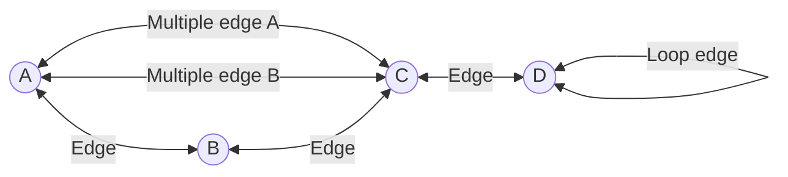
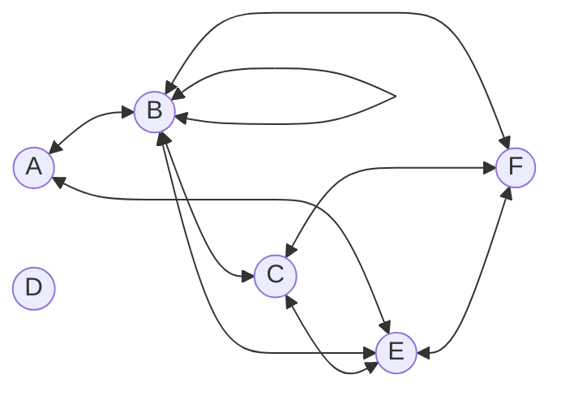
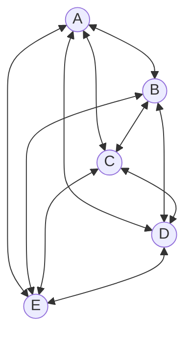
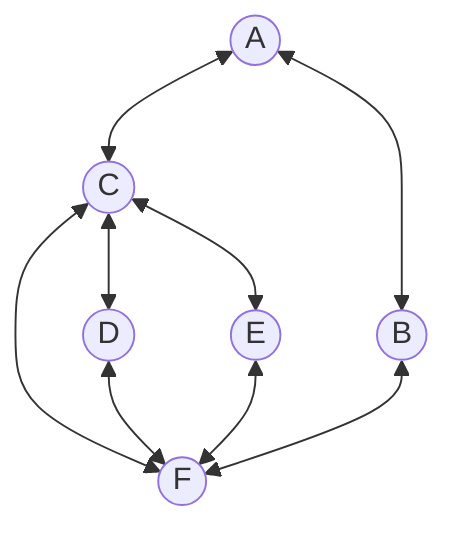
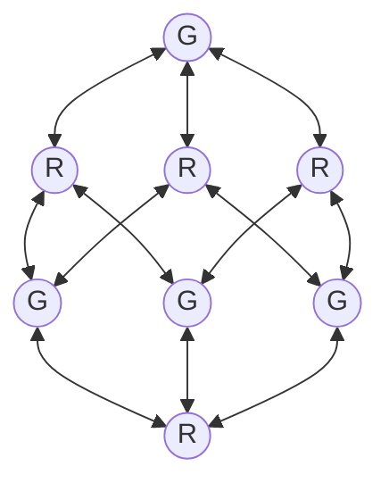

> [!IMPORTANT] 
> Continue from Chapter 12 Recursive Definition

# `Discrete mathematics`

**Read** and **write** mathematical proofs and apply them in Computer Science.

Covers...

* Basic mathematical objects, notation and techniques
* Propositional and Predicate logic, Sets, Functions, Relations, Modular Arithmetic, Counting, Graphs, Trees
* Algorithm analysis and complexity, Automata theory, Computability

## Chapter 1: Math Review

* Refresher on general concepts

### Definitions

1. $\mathbb{Z}$ denotes the set of *all* negative and positive integers
    * $\mathbb{Z} = \\{\ldots, -3, -2, -1, 0, 1, 2, 3, \ldots\\}$
2. $\mathbb{N}$ denotes the set of *all* natural numbers (aka. non-negative integers)
    * non-negative integers: positive integers and zero
    * $\mathbb{N} = \\{0, 1, 2, 3, \ldots\\}$
3. $\mathbb{Z}^+$ or $\mathbb{N}^+$ denotes the set of *all* positive integers
    * positive integer: integer greater than zero
    * $\mathbb{Z}^+ = \\{1, 2, 3, \ldots\\}$
    * $\mathbb{N}^+ = \\{1, 2, 3, \ldots\\}$
4. $\mathbb{Q}$ denotes the set of *all* rational numbers
    * rational numbers: fractions which can be represented by $\frac{p}{q}$ where $q$ can't be zero **and** two fractions are the same number if they are the same when reduced to lowest terms
5. $\mathbb{R}$ denotes the set of *all* real numbers
    * real numbers: rational numbers **and** irrational numbers
    * irrational numbers: numbers which can be represented by $x$ assuming that $\sqrt{x}$ only returns the positive square root of $x$, **such as** $\sqrt{2}$, $\pi$, $e$
6. $\mathbb{C}$ denotes the set of *all* complex numbers
    * complex numbers: numbers of the form $a + bi$ where $a$ and $b$ are real numbers **and** $i=\sqrt{-1}$
7. Infinity ($\infty$) is not a number in standard mathematics.
8. $\in$ denotes membership to a set
    * eg. $x \in \mathbb{R}$ denotes $x$ is a real number
9. $\notin$ denotes absence from a set
    * eg. $y \notin \mathbb{Z}$ denotes $y$ is not an integer

To select a limited range of real numbers, we use an interval of the real line.

10. $[$ $]$ denotes a closed interval that is **inclusive** of its upper and lower bound
    * eg. $[a, b]$ denotes a set of all real numbers from $a$ to $b$, including $a$ and $b$
11. $($ $)$ denotes an open interval that is **exclusive** of its upper and lower bound
    * eg. $(a, b)$ denotes a set of all real numbers from $a$ to $b$, not including $a$ and $b$
12. $[$ $)$ and $($ $]$ both denote half-open intervals that are **inclusive** of one bound and **exclusive** of the other bound
    * $[a, b)$ and $(a, b]$ denote sets of real numbers from $a$ to $b$ that include either $a$ or $b$
13. $\mathbb{R}^2$ denotes the set of all **pairs** of real numbers
    * eg. $\mathbb{R}^2$ contains pairs like -2.3, 4.7
14. $\mathbb{R}^3$ denotes the set of all **triples** of real numbers
    * eg. $\mathbb{R}^3$ contains triples like 8, 7.3, -9
15. Exponentials
    * $b^0 = 1$ 
    * $b^{0.5} = \sqrt{b}$
    * $b^{-1} = \frac{1}{b}$
    * $b^xb^y = b^{x+y}$
    * $a^xb^x = (ab)^x$
    * $(b^x)^y = b^{xy}$
    * $b^{(x^y)}\neq(b^x)^y$
16. Logs
    * $y = b^x$ is $x = \log_b{y}$ **where** $b > 1$
    * $b^{\log_b(x)} = x$
    * $\log_b(xy) = \log_b{x} + \log_b{y}$
    * $\log_b{(x^y)} = y\log_b{x}$
    * $\log_b{x} = \log_a{x}\log_b{a}$ by applying change of base formula
    * $\log{x}$ with **no explicit base** taken to be $\log_2{x}$ since computer algorithms make heavy use of base-2 numbers and powers of 2
17. Factorial function
    * $k! = 1\cdot2\cdot3\cdot\ldots\cdot(k-1)\cdot{k}$
        * eg. $5! = 1\cdot2\cdot3\cdot4\cdot5 = 120$
    * $0! = 1$
18. Permutations and Combinations
    * set $S$ containing $n$ objects (all unique)
    * $n!$ permutations of these objects
        * permutation: number of ways to **arrange** objects in a particular order
    * $\frac{n!}{k!(n-k)!}$ ways to **choose** $k$ (unordered) elements from set $S$
        * $\frac{n!}{k!(n-k)!}$ can be abbreviated as $n \choose k$ (read as $n$ choose $k$)
19. Floor and Ceiling
    * $\lfloor$ $\rfloor$ denotes the **floor** function, which takes a real number $x$ and returns an integer no bigger than $x$ (rounds down)
        * eg. $\lfloor{3.75}\rfloor = 3$
        * eg. $\lfloor{3}\rfloor = 3$
        * eg. $\lfloor{-3.75}\rfloor = -4$
    * $\lceil$ $\rceil$ denotes the **ceiling** function, which takes a real number $x$ and returns an integer no smaller than $x$ (rounds up)
        * eg. $\lceil{3.75}\rceil = 4$
        * eg. $\lceil{3}\rceil = 3$
        * eg. $\lceil{-3.75}\rceil = -3$
20. Summation
    * assuming $a_i$ is a formula that depends on $i$, then
    $$\sum_{i=1}^{n}a_i = a_1 + a_2 + a_3 + \ldots + a_n$$
        * eg.
    $$\sum_{i=1}^{n}\frac{1}{2^i} = \frac{1}{2} + \frac{1}{4} + \frac{1}{8} + \ldots + \frac{1}{2^n}$$
    * **closed form** notation is employed for certain sums
        * general formula
    $$\sum_{k=0}^{n}{r^k} = \frac{r^{n+1}-1}{r-1}$$
        * geometric series pattern
    $$\sum_{i=1}^{n}\frac{1}{2^i} = 1 - \frac{1}{2^n}$$
        * also this one
    $$\sum_{i=1}^{n}{i} = \frac{n(n+1)}{2}$$
    * products are written with the same notation
        * eg. 
    $$\prod_{k=1}^{n}\frac{1}{k} = \frac{1}{1}\cdot\frac{1}{2}\cdot\frac{1}{3}\cdot\ldots\cdot\frac{1}{n}$$
21. $\epsilon$ denotes a string of length 0 containing no characters
22. $\alpha\beta$ denotes the concatenation of the 2 strings $\alpha$ and $\beta$
    * eg. where $\alpha = \text{water}$ and $\beta = \text{melon}$ then $\alpha\beta = \text{watermelon}$
    * eg. where $\alpha = \text{shit}$ then $\alpha\text{s} = \text{shits}$
23. A bit string is a string consisting of the $0$ and $1$ characters.
24. Supposing $A$ is a set of characters, then $A^*$ is a set of all finite-length strings containing characters from $A$.
    * eg. where $A$ contains all lower-case alphabets then $A^*$ contains strings like $\text{onion}$, $\text{e}$, $\text{kkkkmmmmmmbb}$ **and** the empty string $\epsilon$
25. Rudimentary regex support
    * $\text{a}\mid\text{b}$ means either the character $a$ or $b$
    * $\text{a}^*$ means zero or more copies of the character $\text{a}$
    * $($ $)$ show grouping
        * eg. $\text{ab}^*$ specifies all strings that start with $\text{a}$ followed by zero or more $\text{b}$'s
        * eg. $\text{c}(\text{a}\mid\text{b})^*\text{c}$ specifies all strings that start with a $\text{c}$, followed by zero or more characters that are either $\text{a}$ or $\text{b}$, followed by one $\text{c}$

## Chapter 2: Logic

* Propositional logic, Predicate logic

### Definitions

#### Propositional logic

1. $0$: False
2. $1$: True
3. $\neg$: Not
4. $\land$: And
5. $\lor$: Inclusive Or
6. $\oplus$: Exclusive Or
7. $\rightarrow$: Implies
8. $\leftrightarrow$: Biconditional
9. $\equiv$: Logical Equivalence
10. $($ $)$: Groups logically related propositions together

#### Predicate logic

11. $\forall$: Universal quantifier
12. $\exists$: Existental quantifier
13. $\exists!$: Unique Existence quantifier

> [!NOTE]  
> Moving forward, all truth tables will be represented assuming $A$, $B$ and $C$ are all propositions.

### Propositions

* Proposition: statement which is either true or false 
    * states a claim
    * cannot be a question
    * cannot contain variables *(eg. $x\leq9$ is not a proposition)*

#### Complex propositions

* Propositions can be chained together with $\neg$, $\land$ and $\lor$ to create complex propositions.
* Complex propositions are represented by truth tables.

**And truth table**

$$\begin{array}{|c|c|c|}
\hline
A & B & A \land B \\
\hline
0 & 0 & 0 \\
0 & 1 & 0 \\
1 & 0 & 0 \\
1 & 1 & 1 \\
\hline
\end{array}$$

**Inclusive Or truth table**

$$\begin{array}{|c|c|c|}
\hline
A & B & A \lor B \\
\hline
0 & 0 & 0 \\
0 & 1 & 1 \\
1 & 0 & 1 \\
1 & 1 & 1 \\
\hline
\end{array}$$

**Exclusive Or truth table**

$$\begin{array}{|c|c|c|}
\hline
A & B & A \oplus B \\
\hline
0 & 0 & 0 \\
0 & 1 & 1 \\
1 & 0 & 1 \\
1 & 1 & 0 \\
\hline
\end{array}$$

#### Implication

* Two propositions can be joined into a conditional statement in the format of "if *Proposition 1*, then *Proposition 2*".
* Can also be phrased as...
    * "*Proposition 1* implies *Proposition 2*"
    * "*Proposition 2* follows *Proposition 1*"
* *Proposition 1* is called the **hypothesis**.
* *Proposition 2* is called the **conclusion**.

**Implication truth table**

$$\begin{array}{|c|c|c|}
\hline
A & B & A \rightarrow B \\
\hline
0 & 0 & 1 \\
0 & 1 & 1 \\
1 & 0 & 0 \\
1 & 1 & 1 \\
\hline
\end{array}$$

#### Converse

* The converse of $A \rightarrow B$ is $B \rightarrow A$.
* Note that implications frequently only apply in one direction.
    * Therefore, there is **no** guarantee that since $A \rightarrow B$, then $B \rightarrow A$.

**Converse truth table**

$$\begin{array}{|c|c|c|}
\hline
A & B & B \rightarrow A \\
\hline
0 & 0 & 1 \\
0 & 1 & 0 \\
1 & 0 & 1 \\
1 & 1 & 1 \\
\hline
\end{array}$$

#### Biconditional

* Biconditional covers a situation where $A \rightarrow B$ and $B \rightarrow A$.
* $A$ and $B$ are true under exactly the same conditions.

**Biconditional truth table**

$$\begin{array}{|c|c|c|}
\hline
A & B & A \leftrightarrow B \\
\hline
0 & 0 & 1 \\
0 & 1 & 0 \\
1 & 0 & 0 \\
1 & 1 & 1 \\
\hline
\end{array}$$

#### Contrapositive

* Contrapositive just means to negate both the hypothesis and conclusion.
    * eg. the contrapositive of $A \rightarrow B$ would be $\neg B \rightarrow \neg A$

**Contrapositive truth table**

$$\begin{array}{|c|c|c|c|c|}
\hline
A & B & \neg A & \neg B & \neg B \rightarrow \neg A \\
\hline
0 & 0 & 1 & 1 & 1 \\
0 & 1 & 1 & 0 & 1 \\
1 & 0 & 0 & 1 & 0 \\
1 & 1 & 0 & 0 & 1 \\
\hline
\end{array}$$

##### Rules for complex statements

Follow these rules when constructing truth tables.

1. Apply $\neg$ (not operator) first.
2. Apply $\land$ (and) and $\lor$ (inclusive or) operators.
3. Apply $\rightarrow$ (implication) and $\leftrightarrow$ (biconditional) operators.
4. Use $($ $)$ (parantheses) to group logically related propositions together.

#### Logical Equivalence

* 2 propositions are logically equivalent when they are true for the same input values.
    * eg. $A \rightarrow B$ is logically equivalent to $\neg A \lor B$, so it can be said that $A \rightarrow B \equiv \neg A \lor B$

The proof is given that

**$A \rightarrow B$ truth table**

$$\begin{array}{|c|c|c|}
\hline
A & B & A \rightarrow B \\
\hline
0 & 0 & 1 \\
0 & 1 & 1 \\
1 & 0 & 0 \\
1 & 1 & 1 \\
\hline
\end{array}$$

and 

**$\neg A \lor B$ truth table**

$$\begin{array}{|c|c|c|c|}
\hline
A & B & \neg A & \neg A \lor B \\
\hline
0 & 0 & 1 & 1\\
0 & 1 & 1 & 1\\
1 & 0 & 0 & 0\\
1 & 1 & 0 & 1\\
\hline
\end{array}$$

it can be said that $A \rightarrow B$ and $\neg A \lor B$ are logically equivalent.

* Other well-known logical equivalences are...
    1. De Morgan's Laws
        * $\neg (A \land B) \equiv \neg A \lor \neg B$
        * $\neg(A \lor B) \equiv \neg A \land \neg B$
    2. Some useful ones
        * $A \land \neg A \equiv 0$
        * $A \land B \equiv B \land A$
        * $A \lor (B \land C) \equiv (A \lor B) \land (A \lor C)$
        * $A \land (B \lor C) \equiv (A \land B) \lor (A \land C)$
        * $\neg (\neg A) \equiv A$
        * $\neg(A \rightarrow B) \equiv A \land \neg B$
    3. [Actual cheatsheet](https://courses.cs.washington.edu/courses/cse311/24wi/resources/reference-logical_equiv.pdf)

#### Applying propositional logic

> *eg.* Suppose the claim "If M is regular, then M is paracompact or M is not Lindelof."

1. Convert the claim to shorthand.

> Let $A$ be "M is regular"  
> Let $B$ be "M is paracompact"  
> Let $C$ be "M is Lindelof"  
>  
> So the claim is now $A \rightarrow (B \lor \neg C)$

2. Negate the claim.

> Negation of $A \rightarrow (B \lor \neg C)$ would be $\neg(A \rightarrow (B \lor \neg C))$

3. Simplify by applying known logical equivalences.

> Applying the following...  
> $\neg (\neg A) \equiv A$  
> $\neg(A \land B) \equiv \neg A \lor \neg B$  
> $\neg(A \lor B) \equiv \neg A \land \neg B$  
> $\neg(A \rightarrow B) \equiv A \land \neg B$   
>  
> Therefore...  
> $\neg(A \rightarrow (B \lor \neg C)) \equiv A \land \neg(B \lor \neg C) \equiv A \land \neg B \land \neg\neg C \equiv A \land \neg B \land C$

4. Convert the shorthand back to a claim.

> Therefore, the negation of our original claim is "M is regular and M is not paracompact and M is Lindelof."

> [!NOTE]  
> Moving forward, assume that $P()$, $Q()$ and $R()$ are all predicates.

### Predicates

* Predicate: statement that becomes either true or false when its variables are substituted for values
    * eg. $P(x)$ is a predicate where $x^2 \geq 10$
    * eg. $Q(y)$ is a predicate where "the weather is $y$"
    * eg. $R(z)$ is a predicate where "you are smelly when $z$"
* Predicates are useful for making **general statements** about what happens when we subtitute a variety of values for variables.
    * eg. "$P(x)$ is true for every $x$"

#### Quantifiers

1. Universal quantifier: *"for all"*
    * **all** objects have such properties
    * eg. "for all integers $x$, $x^2 \geq 10$"
2. Existential quantifier: *"there exists"*
    * **at least one** object have such properties
    * eg. "there exists an integer $x$ such that $5 \lt x \lt 100$"
3. Unique Existence quantifier: *"there is"*
    * **only one** object have such properties
    * eg. "there is a unique integer $x$ such that $x^2 = 0$"

#### Quantifier notation 

The quantifiers are represented as...

* Universal quantifier: $\forall$
* Existential quantifier: $\exists$
* Unique Existence quantifier: $\exists!$

Below are some worked examples of understanding quantifier notation.

*eg.* $\forall x \in \mathbb{R}, x^2 + 3 \geq 0$

1. $\forall$ is the quantifier
2. $x \in \mathbb{R}$ specifies the variable and the set it belongs to 
    * $x$ is the variable
    * $\in$ denotes membership
    * $\mathbb{R}$ is the set of all real numbers
3. $x^2 + 3 \geq 0$ is the predicate we are asserting
4. Therefore this reads as "For all real numbers $x$, $x^2 + 3 \geq 0$."

*eg.* $\exists y \in \mathbb{R}, y = \sqrt{2}$

1. $\exists$ is the quantifier
2. $y \in \mathbb{R}$ specifies the variable and the set it belongs to
    * $y$ is the variable
    * $\in$ denotes membership
    * $\mathbb{R}$ is the set of all real numbers
3. $y = \sqrt{2}$ is the predicate we are asserting
4. Therefore this reads as "There exists a real number $y$ such that $y = \sqrt{2}$."

*eg.* $\exists!x \in \mathbb{R}, x^2 = 0$

1. $\exists!$ is the quantifier
2. $x \in \mathbb{R}$ specifies the variable and the set it belongs to
    * $x$ is the variable
    * $\in$ denotes membership
    * $\mathbb{R}$ is the set of all real numbers
3. $x^2 = 0$ is the predicate we are asserting
4. Therefore this reads as "There is a unique real number $x$ such that $x^2 = 0$."

> [!IMPORTANT]  
> Multiple quantifiers can be chained together as in the following shorthand.  
>   
> $\forall x \in \mathbb{R}, \forall y \in \mathbb{R}, x + y \geq x$  
>  
> can be shortened to become 
>   
> $\forall x, y \in \mathbb{R}, x + y \geq x$
>   
> and both retain the meaning of "for all real numbers $x$ and $y$, $x + y \geq x$". (Note the predicate itself isn't true, but that's not important here.)

#### Quantifiers and logical equivalences

Here are some logical equivalences derived from the negation of quantifiers.

* $\neg (\forall x, P(x)) \equiv \exists x, \neg P(x)$
* $\neg(\exists x, P(x)) \equiv \forall x, \neg P(x)$
* $\neg (\forall x, P(x) \rightarrow (Q(x) \land R(x))) \equiv \exists x, P(x) \land (\neg Q(x) \lor \neg R(x))$

## Chapter 3: Proofs

Mathematical proofs adhere to certain outlines for proving. 

1. Direct proof
2. Examples, Counter-examples
3. Proof by contrapositive

### Summary

An overview of proving methods for the given claim.

1. **Proving** Universal claim
    * Need to prove universality of claim for all proposed values within the given set
    * Construct general argument with variables (eg. $x$, $y$, $z$) in proof
2. **Disproving** Universal claim
    * Only need prove existential statement of claim failing
    * Find the specific counterexample 
3. **Proving** Existential claim
    * Only need prove existential statement
    * Find the specific example
4. **Disproving** Existential claim
    * Need to prove universality of counterclaim for all proposed values within the given set
    * Construct general argument with variables (eg. $x$, $y$, $z$) in proof

In table form...

| | Prove | Disprove |
| :---: | :---: | :---: |
| **Universal claim** | general argument | specific counter-example |
| **Existential claim** | specific example | general argument |

* Both proofs start by picking an element $x$ from the domain of quantification.
    * *General argument*: $x$ is a random element whose identity isn't uniquely specified
    * *Specific example* or *counter-example*: $x$ is a specific concrete value

### Direct Proof

* Start from **known** information *(variable declarations, definitions, hypothesis)*
* Move to information that has to be **proved**

##### Example 1

> *eg.* Prove the claim "For every rational number $q$, $2q$ is rational."

1. **Identify** the claim.

> This is a universal claim.
>   
> This claim is of the form $\forall x \in A, P(x)$.

2. **Definition(s)** within the claim.

> A real number $r$ is rational if there are integers $m$ and $n$ where $n \neq 0$, such that $r = \frac{m}{n}$.

3. **Substitution** of value(s) into definition.

> Let $q$ be any rational number. From the definition of "rational", we know that $q = \frac{m}{n}$ where $m$ and $n$ are integers and $n \neq 0$. As such, $2q = 2\frac{m}{n} = \frac{2m}{n}$. Since $m$ is an integer, so is $2m$. As such, $2q$ is a ratio of two integers, fulfilling the definition of "rational".

##### Example 2

> *eg.* Prove the claim "For any integer $k$, if $k$ is odd then $k^2$ is odd."

1. **Identify** the claim.

> This is a universal claim.
>   
>  This claim is of the form $\forall x \in \mathbb{Z}, P(x) \rightarrow Q(x)$.

2. **Definition(s)** within the claim.

> An integer $n$ is even if there is an integer $m$ such that $n = 2m$.
>  
> An integer $n$ is odd if there is an integer $m$ such that $n = 2m + 1$.

3. **Substitution** of value(s) into definition.

> Let $k$ be any integer and suppose that $k$ is odd. We now need to prove that $k^2$ is odd. Since $k$ is odd, there exists an integer $j$ such that $k = 2j + 1$.
> 
> Therefore, $k^2 = (2j + 1)^2 = 4j^2 + 4j + 1 = 2(2j^2 + 2j) + 1$.
> 
> Since $j$ is an integer, $2j^2 + 2j$ is also an integer that we can call $p$.
>
> Therefore, $k^2 = 2p + 1$, so by the definition of odd, $k^2$ is odd.

##### Example 3

> *eg.* Prove the claim "There is an integer $k$ such that $k^2 = 0$".

1. **Identify** the claim.

> This is an existential claim.
> 
>  This claim is of the form $\exists x \in A, P(x)$.

2. **Choose a concrete value** that proves the point.

> $0$ is such an integer. So the statement is true.

##### Example 4

> *eg.* Disprove the claim "Every rational number $q$ has a multiplicative inverse."

1. **Identify** the claim.

> This is a universal claim.
> 
>  This claim is of the form $\forall x \in A, P(x)$.

2. **Choose a concrete value** that disproves the point.

> Defining what a multiplicative inverse is, if $p$ and $r$ are real numbers, $r$ is a multiplicative inverse for $q$ if $qr = 1$.
>  
> Given that $0$ has no inverse, the claim is false.

##### Example 5

> *eg.* Disprove the claim "There is an integer $k$ such that $k^2 + 2k + 1 \lt 0$".

1. **Identify** the claim.

> This is an existential claim.
>  
> This claim is of the form $\exists x \in A, P(x)$.

2. **Identify** the counterclaim we need to prove.

> Therefore, we need to prove that "For every integer $k$, $k^2 + 2k + 1 \geq 0$".

3. **Substitution** of value(s) into counterclaim.

> Let $k$ be an integer.
>  
> $k^2 + 2k + 1$ can be factorised to be $(k + 1)^2$.
>  
> $(k + 1)^2 \geq 0$ since the square of any real number is non-negative, so $k^2 + 2k + 1 \geq 0$.
>   
> Therefore the original claim is false.

##### Example 6

> *eg.* Prove the claim "For any integers $m$ and $n$, if $m$ and $n$ are perfect squares, then so is $mn$".

1. **Identify** the claim.

> This is a universal claim.
>  
> This claim is of the form $\forall x,y \in A, P(x,y)$.

2. **Definition(s)** within the claim.

> An integer $n$ is a perfect square if $n = k^2$ for some integer $k$.

3. **Substitution** of value(s) into definition.

> Let $m$ and $n$ be integers and suppose that $m$ and $n$ are perfect squares.
>  
> By the definition of "perfect square", $m = k^2$ and $n = j^2$, so $mn = k^2j^2$, which can be factorised to $(kj)^2$.
>  
> Since $k$ and $j$ are both integers, so is $kj$. 
>  
> Since $mn$ is the square of the integer $kj$, $mn$ is a perfect square and the claim is true.

##### Example 7

> *eg.* Prove the claim "For all integers $j$ and $k$, if $j$ and $k$ are odd, then $jk$ is odd".

1. **Identify** the claim.

> This is a universal claim.
>  
> This claim is of the form $\forall x,y \in A, P(x,y)$.

2. **Definition(s)** within the claim.

> An integer $n$ is odd if there is an integer $m$ such that $n = 2m + 1$.

3. **Substitution** of value(s) into definition.

> Let $j$ and $k$ be integers and suppose they are both odd. 
>   
> Because $j$ is odd, there is an integer $p$ such that $j = 2p + 1$. Similarly, there is an integer $q$ such that $k = 2q + 1$.
>   
> Simplifying the expression, $jk = (2p + 1)(2q + 1) = 4pq + 2p + 2q + 1 = 2(2pq + p + q) + 1$. 
>  
> Given that both $p$ and $q$ are integers, $2pq + p + q$ is also an integer which we call $m$.
>  
> As such, $jk = 2m + 1$, so $jk$ is odd and the claim is true.

#### Proof by cases

* Used when given information results in *two or more* separate possibilities
* Do part of the proof *two or more times*, once for **each of the possibilities**

> [!TIP]  
> It is okay if the cases overlap, but the cases must together cover all possibilities.

##### Example 1

> *eg.* Prove the claim "For all integers $j$ and $k$, if $j$ is even or $k$ is even, then $jk$ is even".

1. **Identify** the claim.

> This is a universal claim.
>  
> This claim is of the form $\forall x \in A \lor \forall y \in A, P(x, y)$.

2. **Definition(s)** within the claim.

> An integer $n$ is even if there is an integer $m$ such that $n = 2m$.

3. **Handle** each possible case.

> Let $j$ and $k$ be integers and suppose that $j$ is even or $k$ is even. 
>  
> There are two cases.
>  
> Case 1: $j$ is even. Then $j = 2m$, where $m$ is an integer. As such, the expression simplifies to $jk = (2m)k = 2(mk)$. Since $m$ and $k$ are integers, so is $mk$. Therefore, $jk$ must be even.
>  
> Case 2: $k$ is even. Then $k = 2n$, where $n$ is an integer. As such, the expression simplifies to $jk = j(2n) = 2(nj)$. Since $n$ and $j$ are integers, so is $nj$. Therefore, $jk$ must be even.

4. **Summarise**

> So $jk$ is even in both cases, and the claim is true.

### Rephrasing claims

* Used when given claim is not in a *good form* for direct proof
* Rephrase the claim to be **readable**
* Rephrase the claim using **logical equivalence**
    * DeMorgan's laws
    * Proof by contrapositive

##### Example 1

> *eg.* Prove the claim "There is no integer $k$ such that $k$ is odd and $k^2$ is even".

1. **Rephrase** the claim to be readable

> The claim is really saying "For every integer $k$, it is not the case that $k$ is odd and $k^2$ is even".

2. **Rephrase** the claim using logical equivalence

> Applying DeMorgan's laws, this is also equivalent to "For every integer $k$, $k$ is not odd or $k^2$ is not even".
>   
> This is effectively the same as "For every integer $k$, $k$ is not odd or $k^2$ is odd".
>  
> Applying the logical equivalence that $\neg p \lor q \equiv p \rightarrow q$, this can be restated as "For every integer $k$, if $k$ is odd then $k^2$ is odd."

The following steps merely involve direct proof of a universal claim as covered above.

#### Proof by contrapositive

* Contrapositive of the claim $\forall x, P(x) \rightarrow Q(x)$ is $\forall x, \neg Q(x) \rightarrow \neg P(x)$
* Proving the contrapositive of a claim allows the inference  that the *original claim* is true

##### Example 1

> *eg.* Prove the claim "For any integers $a$ and $b$, if $a + b \geq 15$, then $a \geq 8$ or $b \geq 8$".

1. **Rephrase** the claim using logical equivalence by way of Proof by contrapositive

> The contrapositive of the claim is "For any integers $a$ and $b$, if it's not the case that $a \geq 8$ or $b \geq 8$, then it's not the case that $a + b \geq 15$".
>  
> Simplifying that further with logical equivalence, that is equivalent to "For any integers $a$ and $b$, if $a \lt 8$ and $b \lt 8$, then $a + b \lt 15$".

2. **Prove** the contrapositive

> We will now prove the contrapositive of the claim. That is, that for any integers $a$ and $b$, if $a \lt 8$ and $b \lt 8$, then $a + b \lt 15$.
>  
> Suppose that $a$ and $b$ are integers such that $a \lt 8$ and $b \lt 8$, this implies that $a \leq 7$ and $b \leq 7$.
>  
> Therefore, $a + b \leq 14$. This implies that $a + b \lt 15$, proving the contrapositive, so the original claim is true.

##### Example 2

> *eg.* Prove the claim "For any integer $k$, if $3k + 1$ is even, then $k$ is odd".

1. **Rephrase** the claim using logical equivalence by way of Proof by contrapositive

> Rephrasing the claim as the contrapositive returns "For any integer $k$, if $k$ is even, $3k + 1$ is odd".

2. **Prove** the contrapositive

> We will now prove the contrapositive of the claim. That is, that for any integer $k$, if $k$ is even, $3k + 1$ is odd.
>   
> An integer $x$ is even if there is an integer $y$ such that $x = 2y$.
>  
> An integer $x$ is odd if there is an integer $y$ such that $x = 2y + 1$.
> 
> Suppose that $k$ is an integer and $k$ is even, then $k = 2m$ where $m$ is an integer. Simplifying the expression, $3k + 1 = 3(2m) + 1 = 2(3m) + 1$. Since $m$ is an integer, so is $3m$.
>  
> Therefore, $3k + 1$ must be odd, proving the contrapositive so the original claim is true.

## Chapter 4: Number Theory

* Charts behaviour of integers
* Useful for...
    * Cryptography 
    * Algorithm randomisation

### Definitions

1. Corollary: The following statement is an *easy consequence* of the preceding claim.
2. Suppose integers $x$ and $y$. $x$ **divides** $y$ if $y = xz$ for some integer $z$.
    * $x$ is the divisor (factor) of $y$
    * $y$ is the multiple of $x$
    * $\mid$: multiple **does divide** by divisor to an integer
        * eg. integer $p$ is even exactly when $2 \mid p$
        * eg. $7 \mid 77$
        * eg. $7 \mid 7$ because $7 = 7 \cdot 1$
        * eg. $(-3) \mid 12$ because $12 = - 3 \cdot -4$
        * eg. $3 \mid (-12)$ because $-12 = 3 \cdot -4$
    * $\nmid$: multiple **does not divide** by divisor to an integer
        * eg. $77 \nmid 7$

> [!WARNING]  
> * $0$ is divisible by any integer.
> * The only divisor of $0$ is $0$.
> * Avoid rephrasing $a \mid b$ to $\frac{b}{a}$ is an integer as it introduces a non-integer rational number into a problem that only involves integers.

3. Integer $x \geq 2$ is **prime** if the only positive factors of $x$ are $x$ and $1$.
4. Integer $x \geq 2$ is **composite** if it is not prime.
5. Every integer $z \geq 2$ can be written as the **product** of one or more prime factors, and this [prime factorization](https://www.mathsisfun.com/prime-factorization.html) is *unique*.
    * $\cdot$: **product** of two numbers
        * eg. $1 \cdot 3 = 3$
6. $z$ is a common divisor of $x$ and $y$ if $z \mid x$ and $z \mid y$.
    * $gcd()$: **greatest common divisor** of two numbers
    * Algorithms to compute $gcd()$
        1. [Division algorithm](https://en.wikipedia.org/wiki/Division_algorithm)
        2. [Euclidean algorithm](https://en.wikipedia.org/wiki/Euclidean_algorithm)
7. $z$ is a common multiple of $x$ and $y$ if $x \mid z$ and $y \mid z$.
    * $lcm()$: **lowest common multiple** of two numbers
8. Suppose two integers $a$ and $b$ share no common factors, then $gcd(a,b) = 1$ and $a$ and $b$ are **relatively prime**.
9. Suppose $k$ is a positive integer, two integers $a$ and $b$ are congruent mod $k$ if $k \mid (a - b)$.
    * $a \equiv b$ (mod $k$): $a$ and $b$ are **congruent mod** $k$
        * eg. $17 \equiv 5$ (mod $12$)
        * eg. $3 \equiv 10$ (mod $7$)
        * eg. $3 \equiv 38$ (mod $7$)
        * eg. $-3 \equiv 3$ (mod $6$)
        * eg. $-3 \equiv 4$ (mod $7$)
        * eg. $-29 \equiv -13$ (mod $8$)
    * $a \not\equiv b$ (mod $k$): $a$ and $b$ are **not congruent mod** $k$
        * eg. $-3 \not\equiv 3$ (mod $7$)

### Applications in Proofs

##### Example 1

> *eg.* Prove the claim "For any integers $a$, $b$ and $c$, if $a \mid b$ and $a \mid c$" then $a \mid (b + c)$."

Proof:

> Let $a$, $b$ and $c$ be integers and suppose that $a \mid b$ and $a \mid c$.
>  
> Since $a \mid b$, there is an integer $k$ such that $b = ak$. Similarly, since $a \mid c$, there is an integer $j$ such that $c = aj$.
> 
> Simplifying the expression, $(b + c) = ak + aj = a(k + j) = (k + j)a$. Since $k$ and $j$ are integers, their sum $(k + j)$ is also an integer, so the claim is true.

##### Example 2

> *eg.* Prove the claim "For any integers $a$, $b$ and $c$, if $a \mid b$ and $b \mid c$ then $a \mid c$."

Proof:

> Let $a$, $b$ and $c$ be integers and suppose that $a \mid b$ and $b \mid c$.
> 
> Since $a \mid b$, there is an integer $k$ such that $b = ak$. Similarly, since $b \mid c$, there is an integer $j$ such that $c = bj$.
> 
> Simplifying the expression, $c = bj = akj = kja$. Since $k$ and $j$ are integers, their product $k \cdot j$ is also an integer, so the claim is true.

##### Example 3

> *eg.* Prove the claim "For any integers $a$, $b$ and $c$, if $a \mid b$ then $a \mid bc$."

Proof:

> Since $a \mid b$, there is an integer $k$ such that $b = ak$.
>
> Simplifying the expression, $bc = akc = kca$. Since $k$ and $c$ are integers, their product $k \cdot c$ is also an integer, so the claim is true.

##### Example 4

> *eg.* Prove the claim "For any integers $a$, $b$, $q$ and $r$, where $b$ is positive, if $a = bq + r$, then $gcd(a,b) = gcd(b,r)$."

Proof:

> Suppose the integer $n$ which is $gcd(a,b)$ where $n \mid a$ and $n \mid b$, and $n$ divides $bq$. So $n$ divides $a - bq$, which is just $r$. So $n$ divides $r$.
>  
> Applying the same line of reasoning, if $n$ divides both $b$ and $r$, then $n$ divides $a$.
> 
> Therefore, the set of common divisors of $a$ and $b$ are exactly the same as the set of common divisors of $b$ and $r$. However, $gcd(a,b)$ and $gcd(b,r)$ are just the largest numbers in the set of common divisors for each set, so if the sets contain the same things, the two $gcd$'s must be equal. So the claim is true.

##### Example 5

> *eg.* Prove the claim "For any integers $a$, $b$, $c$, $d$ and $k$ where $k$ is positive, if $a \equiv b$ (mod $k$) and $c \equiv d$ (mod $k$), then $a + c \equiv b + d$ (mod $k$)."

Proof:

> Let $a$, $b$, $c$, $d$ and $k$ be integers with $k$ being positive, and suppose that $a \equiv b$ (mod $k$) and $c \equiv d$ (mod $k$).
>
> Since $a \equiv b$ (mod $k$), so $k \mid (a - b)$. Similarly, $c \equiv d$ (mod $k$) implies $k \mid (c - d)$. As such, $k \mid (a + c) - (b + d)$.
> 
> By definition of congruence mod $k$, $a + c \equiv b + d$ (mod $k$) so the claim is true.

## Chapter 5: Sets

### Definitions

1. Set: **unordered** collection of objects
2. $\in$: denotes an object is **a member** of a set
3. $\notin$: denotes an object is **not a member** of a set
4. Proper subset: Subset containing *some but not all* elements of the original set
5. Improper subset: Subset containing *all* elements of the original set and is the **same** as the original set
6. $\subset$: denotes that a set is **a proper subset** of another set
    * eg. $A \subset A$ (this is false)
7. $\subseteq$: denotes that a set is (possibly) **an improper subset** of another set
    * eg. suppose sets $A$ and $B$, then $A \subseteq B$ if $\forall x, x \in A \rightarrow x \in B$ (every element of $A$ is in $B$)
    * eg. $\mathbb{Q} \subseteq \mathbb{R}$
    * eg. $A \subseteq A$ (this is true)
8. $\nsubseteq$: denotes that a set is **not a subset** of another set
9. $\\{$ $\\}$: denotes a set literal declared within curly braces
10. $\mid$: separates the variable declaration of a set object from the constraints it must satisfy, read as "such that"
    * some variants of set-builder notation represent the separator as a $:$ colon instead
11. $\ldots$: denotes an unspecified number of set objects
12. $\emptyset$: denotes an empty set (also called a null set)
13. $|$ $|$: denotes the **cardinality** of a set (number of different objects in a set)
    * eg. $|\\{a,b,3\\}| = 3$
    * eg. $|\\{a,3,b,a,3\\}| = 3$
14. Antecedent: statement that logically precedes another
15. Vacuous truth: statement that is true because the antecedent can *never* be satisfied
16. $\cap$: **intersection** (set containing objects that are in both sets)
    * eg. suppose $M = \\{\text{egg,bread,milk}\\}$ and $P = \\{\text{milk,egg,flour}\\}$, then $M \cap P$ is $\\{\text{milk,egg}\\}$
17. Two sets are **disjoint** when they have no elements in common.
    * eg. sets $A$ and $B$ are disjoint when $A \cap B = \emptyset$
17. $\cup$: **union** (set containing all objects from both sets)
    * eg. suppose $M = \\{\text{egg,bread,milk}\\}$ and $P = \\{\text{milk,egg,flour}\\}$, then $M \cup P$ is $\\{\text{milk,egg,bread,flour}\\}$
18. $-$: **set difference** between two sets (set containing objects that are in the first set but not the second)
    * eg. set $(A - B)$ contains all objects that are in set $A$ but not in $B$
    * eg. suppose $M = \\{\text{egg,bread,milk}\\}$ and $P = \\{\text{milk,egg,flour}\\}$, then $M - P$ is $\\{\text{bread}\\}$
19. $\overline{A}$: **complement** of a set (set containing objects that are not in the original set)
    * eg. $\overline{B}$ is the complement of set $B$ and contains all objects that are not in set $B$
20. $U$: **universal set**
    * definition of $U$ varies based on usage within question
21. $\times$: **cartesian product** of two sets (set containing all ordered pairs of values coming from each set)
    * eg. $A \times B = \\{(x,y) \mid x \in A \text{ and } y \in B \\}$
    * eg. suppose sets $A$ and $B$ where $A = \\{a,b\\}$ and $B = \\{1,2\\}$, then $A \times B = \\{(a,1),(a,2),(b,1),(b,2)\\}$
    * eg. suppose sets $A$ and $B$ where $A = \\{a,b\\}$ and $B = \\{1,2\\}$, then $B \times A = \\{(1,a),(2,a),(1,b),(2,b)\\}$

> [!WARNING]  
> Note that order *matters* for cartesian product, so the above two sets are not equal!

Sets can be defined by...

1. **Mathematical english**
    * eg. "The integers between 3 and 7, inclusive."
    * eg. "Multiples of 7." (this is a set containing an infinite number of objects)
2. **Listing** all set members
    * eg. $\\{3, 4, 5, 6, 7\\}$
    * eg. $\\{\ldots, -14, -7, 0, 7, 14, 21, 28, \ldots\\}$ (this too, is a set containing an infinite number of objects)
3. **Set-builder notation** in the format of $\\{$ *variable ranging over all set objects* $\mid$ *constraints objects must satisfy* $\\}$
    * eg. $\\{x \in \mathbb{Z} \mid 3 \leq x \leq 7\\}$
    * eg. $\\{x \in \mathbb{Z} \mid x$ is a mutliple of $7 \\}$ (this is a also a set containing an infinite number of objects)

### Set calculations

1. Inclusion-Exclusion principle
    * $| A \cup B | = |A| + |B| - |A \cap B|$
2. DeMorgan's Law
    * $\overline{A \cup B} = \overline{A} \cap \overline{B}$
3. Product rule
    * Suppose $|A| = n$ and $|B| = q$, then $|A \times B| = nq$.
    * Put into mathematical english, "If you have $n$ choices for one part of a task, and $q$ choices for a second part, and options for the second part **don't depend** on the first part, you have $nq$ options for the whole task."

### Applications in Proofs

##### Example 1

> *eg.* Prove the claim "For any sets $A$, $B$ and $C$, if $A \subseteq B$ and $B \subseteq C$, then $A \subseteq C$."

Proof:

> Let $A$, $B$ and $C$ be sets and suppose that $A \subseteq B$ and $B \subseteq C$.
> 
> Let $x$ be an element of $A$. Since $A \subseteq B$ and $x \in A$, then $x \in B$. Similarly, since $x \in B$ and $B \subseteq C$, $x \in C$.
> 
> So for any $x$, if $x \in A$, then $x \in C$. Therefore, $A \subseteq C$ and the claim is true.

##### Example 2

> *eg.* Prove the claim "For any sets $A$, $B$ and $C$, if $A \times B \subseteq A \times C$ and $A \neq \emptyset$, then $B \subseteq C$."

Proof:

> Let $A$, $B$ and $C$ be sets and suppose $A \times B \subseteq A \times C$ and $A \neq \emptyset$.
> 
> Here, we need to show that $B \subseteq C$.
> 
> Let $x$ be an element from B where $x in B$. Since $A \neq \emptyset$, let $t$ be an element from $A$ where $t \in A$. Then $(t,x) \in A \times B$ by the definition of cartesian product.
> 
> Since $(t,x) \in A \times B$ and $A \times B \subseteq A \times C$, it must hold that $(t,x) \in A \times C$ by the definition of a subset. 
> 
> Given that $x \in C$, we have shown that if $x \in B$ then $x \in C$, so $B \subseteq C$ and the claim is true.

##### Example 3

> *eg.* Prove the claim "For any sets $A$ and $B$, if $(A - B) \cup (B - A) = A \cup B$ then $A \cap B = \emptyset$."

Proof:

> We will prove the contrapositive, so we now need to prove that if $A \cap B \neq \emptyset$, then $(A - B) \cup (B - A) \neq A \cup B$.
> 
> Let $A$ and $B$ be sets and suppose $A \cap B \neq \emptyset$.
> 
> Since $A \cap B \neq \emptyset$, let $x$ be an elemen from $A \cap B$. Since $x$ is in both $A$ and $B$, $x$ is also in $A \cup B$.
> 
> However, since $x$ is in both $A$ and $B$, $x$ is not in $A - B$ or $B - A$. Therefore, $x$ is not a member of $(A - B) \cup (B - A)$, meaning $(A - B) \cup (B - A) \neq A \cup B$, so the claim is true.

## Chapter 6: Relations

### Definitions

1. Relations: relationships between pairs of objects
2. Reflexive: **every element** is related to itself
    * eg. relation $R$ on set $A$ is reflexive where $\forall a \in A, (a,a) \in R$
3. Irreflexive: **no element** is related to itself
    * eg. relation $R$ on set $A$ is irreflexive where $\forall a \in A, (a,a) \notin R$
4. Neither reflexive nor irreflexive: **some elements** are related to themselves but **others** are not
    * eg. relation $R$ on set $A$ is neither reflexive nor irreflexive where $\exists a \in A$ such that $(a,a) \in R$ and $\exists b \in A$ such that $(b,b) \notin R$
5. Symmetric: where an element is related to another, **the reverse** is also true
    * eg. relation $R$ on set $A$ is symmetric where $\forall a,b \in A, (a,b) \in R$ implies $(b,a) \in R$
6. Antisymmetric: where two elements are related in both directions, they are the **same element**
    * eg. relation $R$ on set $A$ is antisymmetric where $\forall a,b \in A, (a,b) \in R$ and $(b,a) \in R$ implies $a = b$
7. Transistive: where an element is related to another element which is related to a third element, the **first element is related to the third**
    * eg. relation $R$ on set $A$ is transistive where $\forall a,b,c \in A, (a,b) \in R$ and $(b,c) \in R$ implies $(a,c) \in R$
8. Partial order: relation that is *reflexive*, *antisymmetric* and *transitive*
9. Linear order (total order): partial order where each pair of elements are *comparable*
10. Strict partial order: relation that is *irreflexive*, *antisymmetric* and *transitive*
11. Equivalence relation: relation that is *reflexive*, *symmetric* and *transitive*

## Chapter 7 & 8: Functions, Onto and One-to-One

### Definitions

1. Function: provides one output value for each input value
2. Domain: set of all possible values accepted as function arguments
3. Co-domain: set of all possible return values based on function definition
4. Type signature: **Combination** of a function's domain and co-domain
5. Onto (surjective, map): every element of a function's co-domain is **mapped** to *at least one* element of its domain
6. One-to-one (injective): every element of a function's domain **maps** to *one unique* element of its co-domain
7. Function composition: **combining** two functions to form a new function
8. $\circ$: denotes the **second function** having its *co-domain mapped onto the domain* of the **first function** via function composition
    * eg. suppose the functions $f : A \to B$ and $g : B \to C$, then $g \circ f = (g \circ f)(x) = g(f(x))$ which accepts argument $A$ and returns $C$
9. Bijective (bijection, one-to-one correspondence): an inverse function
    * requires the original function to be **both** *onto* and *one-to-one*
10. Pigeonhole principle: suppose $n$ objects with $k$ labels assigned to these objects, where $n \gt k$, **two object will get the same label**
11. Permutation: number of ways to **arrange** objects in a particular order
12. Suppose set $S$ containing $n$ objects (all unique)
    * $n!$ permutations of these objects
    * $\frac{n!}{(n-k)!}$ ways to choose $k$ **ordered** elements from set $S$
    * $\frac{n!}{k!(n-k)!}$ ways to choose $k$ **unordered** elements from set $S$

> [!IMPORTANT]
> In function composition, examine the *shorthand notation* to describe a function rather than the mathematical english used for which function is applied first.

### Applications in Proofs

##### Example 1

> *eg.* Prove the claim "For any sets $A$, $B$ and $C$ and for any functions $f : A \to B$ and $g : B \to C$, if $f$ and $g$ are onto, then $g \circ f$ is also onto."

Proof:

> Let $A$, $B$ and $C$ be sets and $f : A \to B$ and $g : B \to C$ be functions. Also suppose that $f$ and $g$ are onto.
> 
> We want to show that $g \circ f$ is onto, which also means that for any element $x$ in $C$, there is an element $y$ in $A$ such that $(g \circ f)(y) = x$. 
> 
> For some element $x$ in $C$, since $g$ is onto, there is an element $z$ in $B$ such that $g(z) = x$. Similarly, since $f$ is onto, there is an element $y$ in $A$ such that $f(y) - z$.
> 
> Substituting the value $f(y) = z$ into the equation $g(z) = x$, we then get $g(f(y)) = x$ which simplifies to $(g \circ f)(y) = x$. So $y$ is the element of $A$ and the claim is true.

##### Example 2

> *eg.* Prove the claim "Among the first $100$ powers of $17$, there are two distinct powers which differ by a multiple of $57$."

Proof:

> The first $100$ powers of $17$ are $17^1, 17^2, \ldots, 17^{100}$. Considering their remainders $\text{mod }57$ as $r_1, r_2, \ldots, r_{100}$, since there are only $57$ possible remainders $\text{mod }57$, two of the numbers $r_1, r_2, \ldots, r_{100}$ must be equal by the pigeonhole principle. 
> 
> Supposing that $r_j$ and $r_k$ are equal, then $17^j$ and $17_k$ have the same remainder $\text{mod }57$, so $17^j$ and $17_k$ differ by a multiple of $57$ and the claim is true.

## Chapter 9: Graphs

> [!NOTE]  
> Moving forward, $V$ represents a set of all nodes and $E$ represents a set of all edges in a graph.

### Definitions

1. Graph: object consisting of *nodes* and *edges*
    * Graph notation in the format of $(V,E)$
2. Node: individual **point** on a graph
3. Edge: **undirected** line *connecting* two nodes
    * Edges are undirected unless explicitly stated
    * Edge notation in the format of $xy$ (or $\\{x,y\\}$), which represents an edge connecting the nodes $x$ and $y$
4. Neighbours: two adjacent nodes connected by an edge 
5. Directed: an edge can be traversed in *one direction*
6. Undirected: an edge can be traversed in *both directions*
7. Multiple edges: *parallel edges* between the same two nodes
8. Loop edge: an edge with the *same node* as both its endpoints
9. Simple graph: graph with neither **multiple edges** nor **loop edges**
    * Graphs are simple graphs unless explicitly stated

> [!WARNING]
> The above is *not* a simple graph since it contains both multiple edges and loop edges.

10. Degree: *number of edges* which have a specified node as an **endpoint**
    * Loop edges count twice
11. $deg()$: specifies the degree of a given node
    * eg. referring to the graph below, $deg(A) = 2$, $deg(B) = 6$, $deg(C) = 3$, $deg(D) = 0$, $deg(E) = 4$, $deg(F) = 3$

12. Handshaking theorem: $\sum_{v \in V} deg(v) = 2|E|$ where $v$ is an individual node 
13. Complete graph: graph where *every node* is **connected** to *every other node*
    * A complete graph will have $\sum_{k=1}^{|V|}(|V|-k) = \sum_{k=0}^{|V|-1}k = \frac{|V|(|V|-1)}{2}$ edges

14. Cycle graph: graph where *every node* has exactly 2 neighbours, forming a **closed loop**
    * A cycle graph has $|V|$ nodes and $|V|$ edges
15. Wheel graph: cycle graph with an added **central hub node** that is connected to *every other node*
    * A wheel graph has $|V|$ nodes and $(|V|-1) \times 2$ edges
16. Graph isomorphism: logical equivalence in graphs
    * To determine if two graphs are isomorphic...
        1. graphs must have **same** number of nodes and edges
        2. for any given node degree $k$, the graphs must have the same number of nodes with degree $k$
17. Subgraph: smaller graph formed from a *subset of nodes and edges* of a larger graph
18. Walk: traversal of a graph from a start node to an end node, represented either by a finite sequence of nodes or a finite sequence of edges
19. Length of a walk: number of edges in a walk's sequence
20. Closed walk: walk with the same start and end node
21. Open walk: walk with different start and end nodes
20. Path: walk where no node is traversed more than once
21. Cycle: closed walk with a minimum length of three, in which no node is traversed more than once (aside from the start and end node)
22. Acyclic: graph that contains no cycles
23. Connected: graph where there is a walk between *every pair* of nodes
24. Disconnected: graph where there is **not** a walk between *every pair* of nodes
25. Cut edge: edge, which when removed converts the connected graph into a disconnected graph
26. Distance: length of *path* connecting two nodes
    * eg. distance $d(a,b)$ between nodes $a$ and $b$ is the length of the shortest path from $a$ to $b$
27. Diameter: distance between *furthest pair* of nodes
28. Euler circuit: closed walk that uses each edge **exactly once**
    * eg. referring to the graph below, a euler circuit would be $ac, cd, df ,fe ,ec ,cf ,fb, ba$

29. Bipartite: graph of $(V,E)$ where $V$ can be split into two non-overlapping subsets $V_1$ and $V_2$ such that *every edge* of the graph connects an element of $V_1$ with $V_2$, and *no edge* connects two nodes from the same part of the division
    * eg. referring to the cube graph below, it is bipartite since assigning nodes to the $R$ and $G$ groups reveals that there are no edges connecting an $R$ node to a $R$ node, or a $G$ node to a $G$ node

## Chapter 10: 2-way Bounding

### Definitions

1. 2-way bounding: analysis and proofs regarding properties on discrete quantities using a **lower** and **upper** bound, used to find limits and prove equality
2. Tight bound: situation in 2-way bounding where the lower and upper bound are *exactly the same*
3. Pigeonhole principle: suppose $m$ containers to fit $n$ items in, where $n \gt m$, there must be *at least* one container with *more than* one item
4. Graph coloring: assign colors to graph nodes where *no two* neighbouring nodes share the same color, using the **minimum** number of colors possible
5. Chromatic number: **minimum** number of colors required for a proper coloring of a graph

### Applications in Proofs

##### Example 1

> *eg.* Prove the claim "Suppose $T$ is an equilateral triangle with sides of length two units, we can place a maximum of four points in the triangle such that every pair of points are more than $1$ unit apart."

Proof:

> To show the maximum is at least four, notice that we can place three points at the corners of the triangle and one point in the centre. The points at the corners are two units apart.
>  
> To see that the point in the center is more than one unit from any corner, notice that the center, the corner and the midpoint of the side form a right triangle. The hypotenuse of this triangle connects the center point to the corner point. Since one leg of the triangle has length $1$, the hypotenuse must have a length greater than $1$.
>  
> Next, to show that the maximum number of points cannot be greater than four, divide up the triangle into four smaller equilateral triangles.
>  
> Suppose we then tried to place five or more points within the big triangle, since there are only four small triangles, by the piegonhole principle, some small triangle would have to then contain at least two points. Since the small triangle has a specified side length of $1$, these points cannot then be separated by more than one unit.

##### Example 2

> *eg.* Prove the claim "Let $A = \\{ 15p + 9q \mid p,q \in \mathbb{Z} \\}$ then $A = \\{ \text{multiples of 3} \\}$."

Proof:

> Let $x$ be an element of $A$, then by definition of $A$, $x = 15s + 9t$ for some integers $s$ and $t$. Simplifying the expression via factorization, $x = 3(5s + 3t)$, and since $5s + 3t$ is also an integer, $x$ is a multiple of $3$.
>  
> Next, notice that $15 \cdot (-1) + 9 \cdot 2 = 3$. By extension, supposing $x$ is a multiple of $3$ as shown above, then $x = 3n$ for some integer $n$. As such, $x = (15 \cdot (-1) + 9 \cdot 2)n$, which simplifies to $x = 15 \cdot (-n) + 9 \cdot (2n)$. Therefore, $x$ is an element of $A$.
>  
> Since $A \subseteq \\{ \text{multiples of 3} \\}$ and $\\{\text{multiples of 3}\\} \subseteq A$, we can conclude that $A = \\{\text{multiples of 3}\\}$.

## Chapter 11: Induction

Mathematical induction provides a template for constructing direct proofs, legitimised by...

* [Domino theory](https://www.math.hkbu.edu.hk/stuarea/revision/section1.pdf)
* [Recursion fairy](https://otfried.org/courses/cs206/notes/recursion.pdf)
* [Property of integers](http://www.cs.engr.uky.edu/~cheng/cs275/Notes/RPG-4-Int1.pdf)

### An outline of mathematical induction

Induction generally follows the template below.

##### 1. Claim

$P(n)$ is true for all positive integers $n$

##### 2. Proof

We use mathematical induction on $n$.

##### 3. Base

We need to show that $P(1)$ is true.

##### 4. Induction

Suppose that $P(n)$ is true for $n = 1,2,3,\ldots,k-1$. We therefore need to show that $P(k)$ is true.

### Applications in Proofs

##### Example 1

> *eg.* Prove the claim "For any natural number $n$, $n^3 - n$ is divisible by $3$."

Proof:

> Here, $P(n)$ is the claim "natural number $n$ where $n^3 - n$ is divisible by $3$." Following the template above, our proof is as follows.
>
> 1. Claim: $P(n)$ is true for all natural numbers $n$.
> 2. Proof: By induction on $n$.
> 3. Base: Let $n=0$, where we want to prove that $n^3 - n$ is divisible by $3$ when $n=0$. Simplifying the expression, $n^3 - n = 0^3 - 0 = 0$ which is divisible by $3$.
> 4. Induction: Suppose that $n^3 - n$ is divisible by $3$, for $n=0,1,2,\ldots,k$. Therefore, we need to show that $(k+1)^3 - (k+1)$ is divisible by $3$. Simplifying the expression, $(k+1)^3 - (k+1) = (k^3 + 3k^2 + 3k + 1) - (k + 1) = (k^3-k)+3(k^2+k)$. From the inductive hypothesis, $(k^3 - k)$ is divisible by $3$. Similarly, $3(k^2+k)$ is divisible by $3$ since $(k^2+k)$ is an integer. Therefore, the sum of $(k^3-k)$ and $(k^2+k)$ is divisible by $3$, proving the claim by way of induction.

##### Example 2

> *eg.* Prove the claim "Every amount of postage that is at least $12$ cents can be made from $4$-cent and $5$-cent stamps."

Proof:

> Here, $P(postage)$ is the claim "postage that is at least $12$ cents can be made from $4$-cent and $5$-cent stamps." Following the template above, our proof is as follows.
>  
> 1. Claim: $P(postage)$ is true for all natural numbers $postage$.
> 2. Proof: By induction on $postage$.
> 3. Base: If $postage$ is $12$, we can make it with three $4$'s. If $postage$ is $13$, we can make it with two $4$'s and one $5$. If $postage$ is $14$, it is made from one $4$ and two $5$'s. For $15$, $postage$ is comprised of three $5$'s.
> 4. Induction: Suppose we have to show how to construct $postage$ where $12 \lt postage \lt k-1$, then we need to show how to construct $k$. Above, we've already proved the base case up to $15$, so we'll move forward assuming $k \geq 16$. Since $k \geq 16$, $k-4 \geq 12$. By the inductive hypothesis, we can construct $postage$ for $k-4$ using $m$ $4$'s and $n$ $5$'s, for some natural numbers $m$ and $n$. As such, $k-4=4m+5n$, which simplifies to $k=4(m+1)+5n$. Therefore, we can construct $k$ using $m+1$ $4$'s and $n$ $5$'s, proving the claim by way of induction.
  
## Chapter 12: Recursive Definition

## More on

* [Building Blocks for Theoretical Computer Science](https://mfleck.cs.illinois.edu/building-blocks/index-sp2020.html) by Margaret M Fleck
