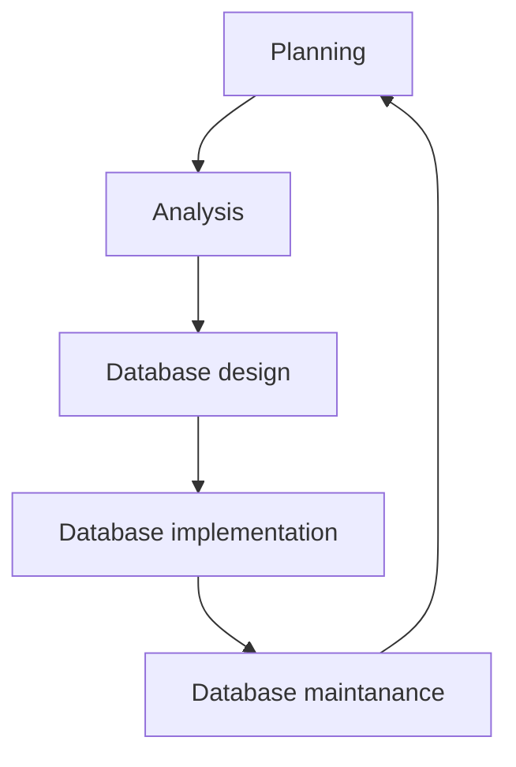

# `SQL`

SQL is a standardised language for interacting with relational database management systems (MySQL, Oracle, Sybase).

## Quickstart

```sql
-- ---------- QUICKSTART ---------
    -- data => stored representations of bits, forming inetgers, floats, strings
    -- metadata => properties of data that give data significance and context
    -- information => processed data that increases knowledge in users (this is mostly semantics so ignore this definition)
    -- database => structured collection of logically-related data 
    -- redundancy => good for cybersecurity, but bad in databases where repetition might render a database inconsistent

-- ---------- DATABASE ENVIRONMENT -----------
    -- repository => storehouse for metadata
    -- database => storehouse for data
    -- database management system (DBMS) => software to manage a database
    -- application programs => apps that use the data
    -- user interface => UI that end users see
    -- end users => application and database users
    -- system developers => app developers
    -- data administrators => database engineers

-- ---------- DATABASE LIFECYCLE ----------
    -- 1. PLANNING
        -- business provides business rules for database engineers
        -- business rule => atomic statements that specify constraints on the way the business should work
    -- 2. ANALYSIS
        -- database engineers do data modelling
        -- E-R diagram notation
            -- entity symbols
            -- attribute symbols
            -- relationship symbols
        -- entity => building block of E-R diagram used to model a basic unit in an organisation
            -- entity type => class and its class attributes
            -- entity instance => instance object and its instance attributes
        -- attribute => property of an entity type
            -- simple => basic attribute, just list each attribute within the entity type
            -- composite => attribute comprised of multiple composite attributes, declared within () brackets and comma-delimited, an example being an address being comprised of street address, city, state and postal code as its composite attributes, and note that we can have a multi-valued attribute that consists of composite attributes
            -- multi-valued => an attribute that in memory, is represented as a list that contains one or more attributes, declared within {} curly braces
            -- derived => attributes that don't need to be explicitly assigned and can be calaculated based on other assigned values within the database, declared within [] square brackets, and example being able to compute number of years employed for an employee since we have their year of employment recorded as a stored attribute
            -- identifier => attribute that uniquely distinguishes an entity instance from all other entity instances, only one default identifier can be chosen and the identifier cannot be null or a mutable value, declared by being underlined, an example being a studentID
                -- simple identifier => simple attribute assigned as an identifier, declared by being underlined
                -- composite identifier => either a composite attribute that is assigned as an identifier underlined directly, or multiple simple attributes forming one composite identifier then having each composite attribute that comprise the composite identifier being underlined
    -- 3. DATABASE DESIGN
    -- 4. DATABASE IMPLEMENTATION
    -- 5. DATABASE MAINTENANCE
```

## Database lifecycle



## E-R diagram notation


## Comments

```sql
-- --------- COMMENT ----------

-- single-line comments

-- there is no special syntax for multi-line comments
```

## Commands

* semi-colon language
* keywords are not case-sensitive, but are capitalised by convention
* database, table and column names are case-sensitive
* a database is a collection of tables

```sql
-- ---------- COMMAND ----------
    -- database commands
    -- table commands

-- ---------- DATABASE ----------
    -- CREATE DATABASE {database name} => creates specified database
    -- DROP DATABASE {database name} => deletes specified database
    -- SHOW DATABASES => lists all available databases
    -- USE {database name} => choose an existing database

CREATE DATABASE parklaneCaiFan;
DROP DATABASE parklaneCaiFan;
SHOW DATABASES;
USE parklaneCaiFan;

-- ---------- TABLE ----------
    -- CREATE TABLE {table name} ({column name(s)}) => creates specified table with specified columns
    -- INSERT INTO {table name} VALUES({row value(s)}) => creates an entry in a specified table
    -- UPDATE {table name} SET {value to be updated} WHERE {predicate to enforce value to be updated} => updates an entry in a specified table
    -- DELETE FROM {table name} => deletes rows from the specified table
    -- DROP TABLE {table name} => deletes the specified table
    -- SELECT {column name(s)} FROM {table name} {augmentation(s)} => general syntax to specify which row or column to select from in a table

CREATE TABLE employees (first_name VARCHAR(20), last_name VARCHAR(20), employee_name VARCHAR(20), employee_num BIGINT); -- creates a table called employees that has the column names of first_name, last_name, employee_name and employee_num and their specified data types
INSERT INTO employees VALUES('John', 'Piper', 'John Piper', 101); -- inserts a row of data entry into the employees tablee, and assumes the values and table have been correctly assigned
UPDATE employees SET first_name='Watermelon' WHERE last_name='Piper' -- updates a first_name value in a row to 'Watermelon' where the last_name value was 'Piper' in the employees table
DELETE FROM employees WHERE last_name LIKE 'P%'; -- deletes rows from the employees table where the last_name begins with 'P', deleting the 'Watermelon Piper' row data entry
DELETE FROM employees; -- deletes all rows from employees table, leaving an empty table
DROP TABLE employeesl -- deletes the entire employes table

-- AUGMENTATION
    -- * => wildcard all operator
    -- LIMIT => limits selection
    -- WHERE => specifies a predicate
    -- LIKE => similar to a partial equality check operator
    -- % => wildcard string operator to represent any string of characters with indeterminate count
        -- 'abc%' specifies a field that starts with 'abc'
        -- '%abc' specifies a field that ends with 'abc'
        -- '%abc%' specifies a field that contains the substring 'abc' in the middle of it
    -- _ => catch-all operator to represent any character with a specific count
    -- DISTINCT => show unique entries only with no duplicates
    -- ORDER BY => sorts values by their title (case-sensitive)
    -- COUNT() => returns the count of whatever field specified within brackets
    -- JOIN => combines rows from two or more tables based on a related column between them
        -- INNER JOIN => selects only matched rows in both tables
        -- LEFT JOIN => selects all rows from left table and matched rows from right table
        -- RIGHT JOIN => selects all rows from right table and matched rows from left table
        -- FULL JOIN => selects all rows from left or right table as long as there is a match in either
    -- ON => specifies a predicate for the JOIN clause

SELECT * FROM employees; -- select all rows and columns from parklaneCaiFan database's employees table
SELECT working_hrs, employee_name FROM employees; -- select only the working_hrs and employee_name column from employees table

SELECT * FROM employees LIMIT 5; -- selects all columns from employees table but only the first 5 rows

SELECT working_hrs FROM employees WHERE employee_name LIKE '%auntie%' -- selects all working_hrs column values from employees table where the employee_name contains the substring 'auntie'
SELECT * FROM employees WHERE employee_name LIKE 'S____'; -- selects all columns values from employees table where the employee_name starts with an S and has exactly 4 characters after it

SELECT DISTINCT working_hrs FROM employees; -- selects working_hr values from the employees table but doesn't show duplicates
SELECT DISTINCT working_hrs FROM employees ORDER BY employee_name; -- selects working_hr values from the employees table but doesn't show duplicates, then sorts them  by employee name case-sensitive

SELECT COUNT(*) FROM employees; -- selects and shows the number of rows in the employees table
SELECT COUNT(*) FROM employees WHERE employee_name LIKE '%auntie%'; -- similar to above, selects and shows the number of rows in the employees table with 'auntie' as a substring of the employee_name value

SELECT employees.first_name, employees.last_name FROM employees INNER JOIN payslip ON employees.employee_num = payslip.employee_num LIMIT 10; -- inner join the employees table column values of first name and last name when the payslip table's employee_num value is the same as employees table employee_num value, limited to 10 rows

SELECT * FROM INFORMATION_SCHEMAD.TABLES WHERE TABLE_TYPE='BASE TABLE'; -- list all tables in a database, though different implementations provide their own shortcut command to achieve this
```

## More on

* [modern database management textbook](https://library.lol/main/1E408DAED98F12A01C57A47CE5E28396)
* [mysql documentation](https://dev.mysql.com/doc/)
* [different sql implementations](https://troels.arvin.dk/db/rdbms/)
* [learn sql in y minutes](https://learnxinyminutes.com/docs/sql/)
