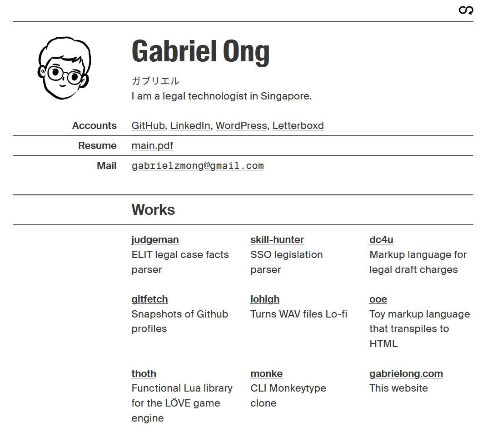
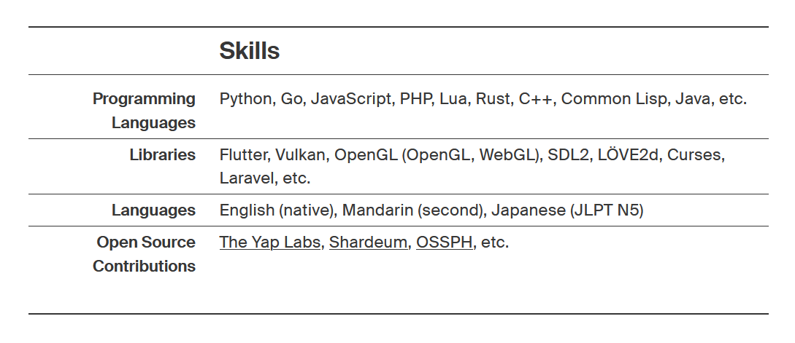
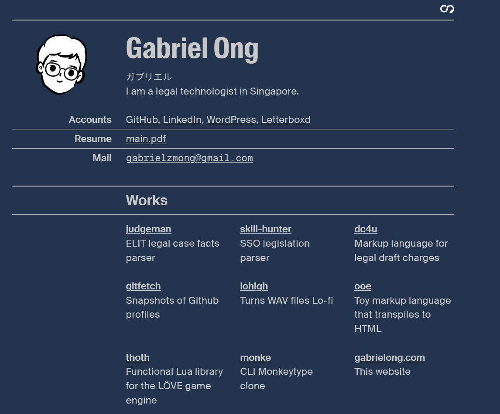
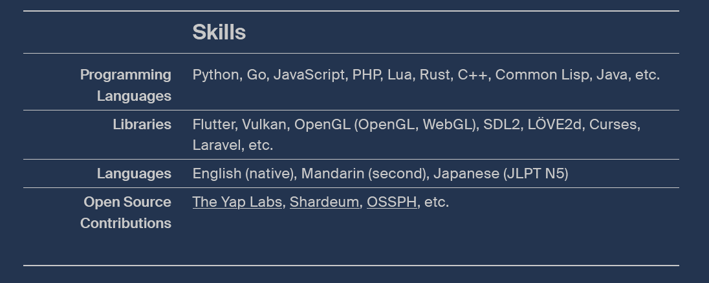

# portfolio site version 3

* [BLUF](https://en.wikipedia.org/wiki/BLUF_(communication))
* pastel color wheel with neutral tones for text
* dynamic grid layout for projects

### technologies

### resources

* visual reference from [Hajime Hoshi](https://hajimehoshi.com/)
* icons are from [simpleicons](https://simpleicons.org/?q=smile)

### screenshots

