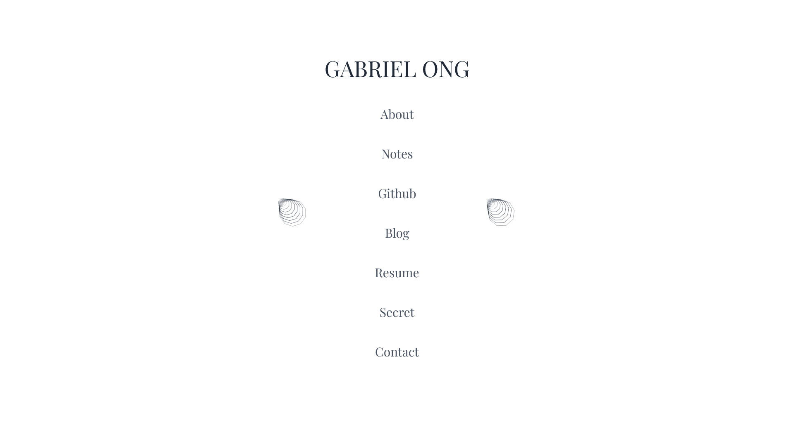
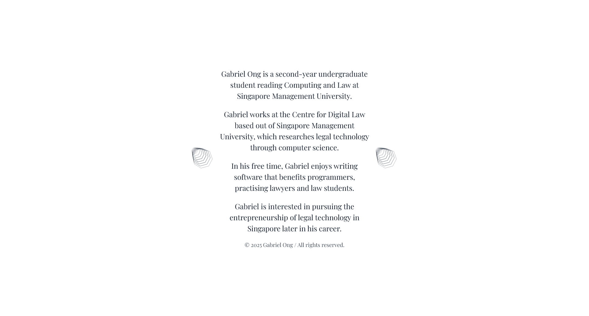
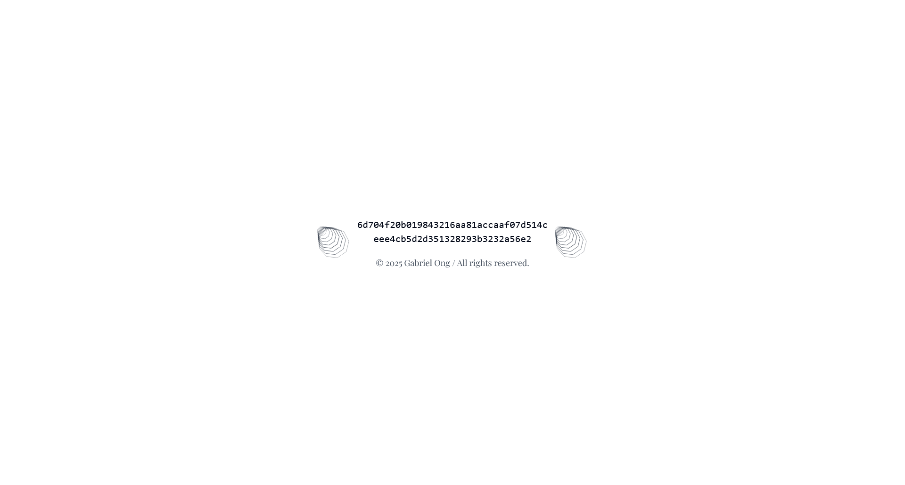
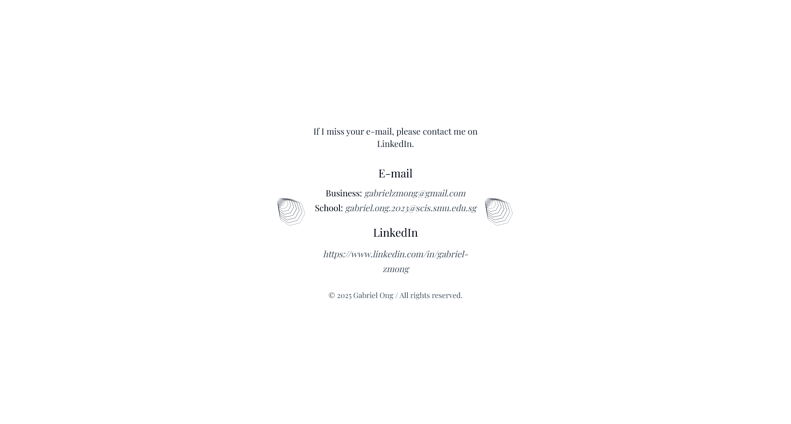

# portfolio site version 5

* minimalist design ethos
* interpolated polygon transform animations
* randomised header strings

### technologies


### resources

* visual reference from [Library of Babel](https://libraryofbabel.info/)

### screenshots






### usage

```console
$ cd src/personal-site-v6
$ npm install framer-motion
$ npm install @tailwindcss/typography
$ npm install @next/font
$ npm run dev
```
