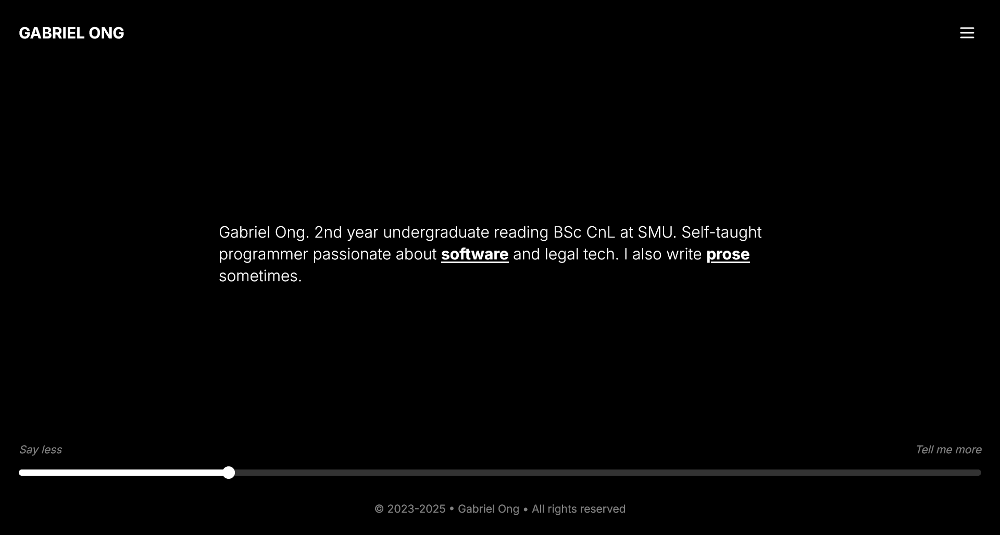
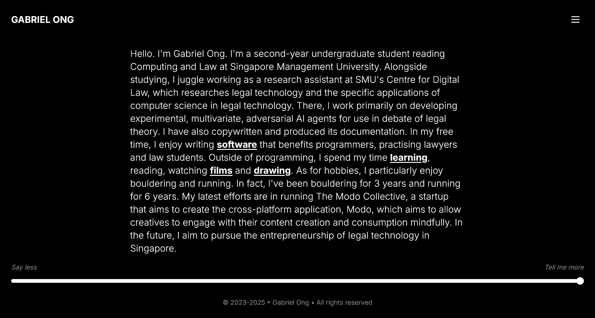
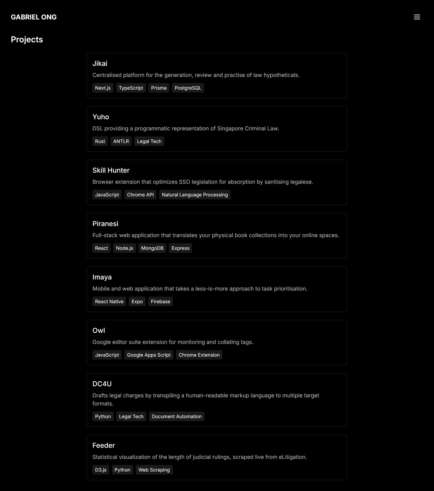

# portfolio site version 7

* user interaction
* sleek and intuitive UI
* smooth animations

### technologies


### resources

* visual reference from [Joe Coleman's personal site](https://getcoleman.com/)

### screenshots









### usage

```console
$ cd src/personal-site-v7
$ npm install @radix-ui/react-dialog @radix-ui/react-separator @radix-ui/react-slider lucide-react class-variance-authority clsx tailwind-merge
$ npx shadcn@latest add button sheet slider separator
$ npm run dev
```
