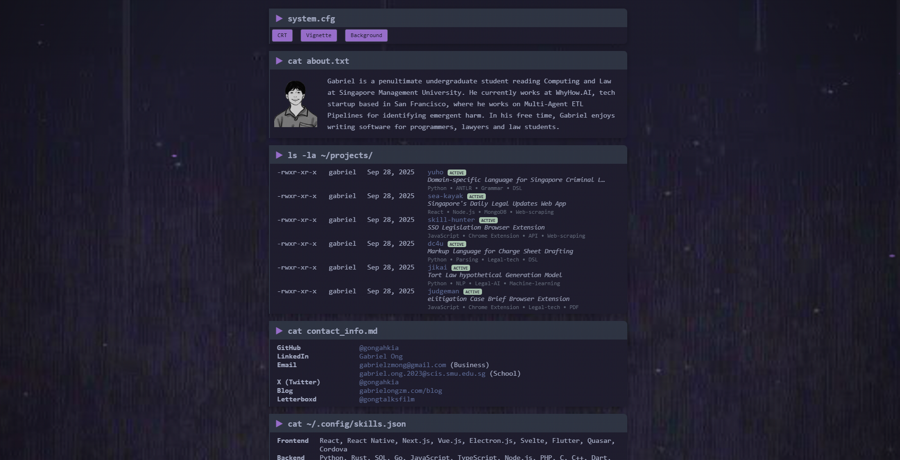
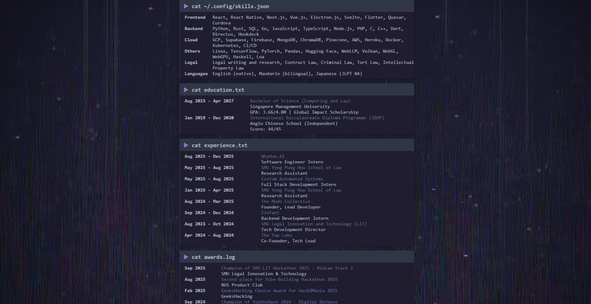
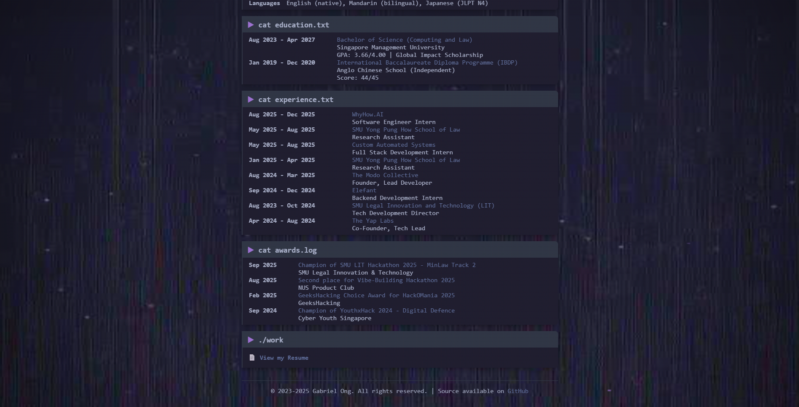

# portfolio site version 9

* retro, modular design
* references to cli commands

### technologies

### resources

* visual reference from [dinama.dev's personal site](https://dinama.dev/)

### screenshots

