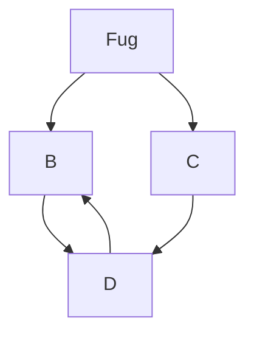

# My Structured Query Language

https://www.youtube.com/watch?v=5OdVJbNCSso



```
mermaid
    gitGraph
       commit
       commit
       branch develop
       commit
       commit
       commit
       checkout main
       commit
       commit
```
