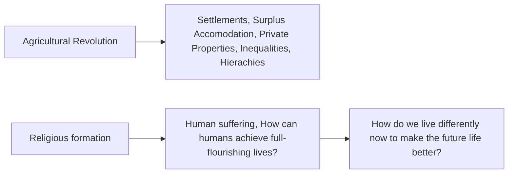

# Pls go do :c

1. Read up on...
    * `Politics of Representation`
2. Use [Google Scholar](scholar.google.com)
    * [Google Scholar boolean operators --> REGEX for googling](https://southern.libguides.com/google/boolean)
3. Download and familiarise myself with [Zotero](https://www.zotero.org/) --> Research purposes
4.  Go look at essay questions, brainstorm what I want to do topic 8 or scope accordingly in relation to happiness or suffering --> Elearn
    * Look at the impact of shared ideology (religion, political systems) in the pursuit of happienss and suffering?
        * Mao's China (1950-1975)
        * Other communist examples
        * Khmer Rogue
        * Enlightenment era Christianity
        * Pacific Rim 
        * Pre-WW2 Japan religion and Post-WW2 Shintoism
        * How do the different strands of buhdism relate to happiness and suffering? 
            * Dalai Lama
        * Examine the assumption that the chief end of man is to be happy *(across religions)*
    * How does early Christanity reconcile the secular desire for happiness?
5. Drop Aidran a telegram message *(check the BQ tele group)* and ask him if its ok, continue to refine it on google docs

## Ontology

* Different AXIOMS to begin with, examine how different religions handle the core questions about the divine every man has.

#### Christian 

* Examine the interstatial overlaps between the western narrative that religion *(judeo-Christian)* constructs and that western media *(often secular, but often accepted)* pushes consistently
* People are born into sin (categorised as unhappy) and enter into the Christian life through Christ (for them to be living a full life)

#### Buhhdism 

* Life is suffering

# Writing essays

## Scoping

* Be cocksure of the core and supplementary arguments you want to aim for in the essay.

## Conclusion

* Finally can make reference to things OUTSIDE the parameter of the research paper that would **add extra depth** to the research paper. 
    * In the scholarly world, this opens up avenues for other academics or yourself in the future to write more.

## References

* The references provide scholarly context for the sources writer used to arrive at their targeted conclusion

## Critique 

* Be aware of the
    * Research essay scope EXPRESSED by the writer
    * Historical, Cultural, Socio-economic agenda of the writer

# Definitions

1. Happiness
    * arises from other stimulus *(relationships, individual experience, communal experience)*
    * unique to the individual

2. Politics of representation
    * Literally *re-present* 
    * Vested interest from the government to promote agenda of communal living
        * Mainly centred around HDB communities, happy chance interactions and opportunities contingent on buying into the average singaporean dream that is sold to the mass populace
    * How is the propaganda of happiness being sold to lesser developed countries?
        * IMF selling the economic dream of happiness to DC like India/Korea early 1970s
        * White imperealism
    * How do we measure happiness?
        * Success as a measure of happiness
        * We can only know happiness because life provides sadness as well

3. Ontology
    * Systems by which we acquire knowledge

4. Deontology 
    * Ethical theory on how we know what is right and wrong

5. Epistomology
    * How we know what we know

# Summary of Week 1 readings

## 1. `McMahon 2013 (Chapter 19)`

* Notion that each person inherently **deserves** happiness, and that it should be an IDEAL GOAL to attain is a relatively *recent one* since the 18th century.

### Greeks on happiness

#### Croesus and Solon

* **Croesus**, king of Lydia is overcome by the longing to be the happiest man in the world. 
* **Solon**, lawgiver of Athens disagrees with Croesus, telling him "divine is altogether jealous and prone to trouble us", "there is much to see that one would rather not see and much to suffer likewise".
Croesus dismissed Solon, and subsequently is handed divine retribution leading to his death at his funeral pyre, exclaiming "noone who lives is happy".

> The relentless pursuit of happiness threatens always to subvert itself.

#### Aristotle 

* **Aristotle**: "The more (a happy man) has every virture and the happier he is, the more pain he will feel at the prospect of death. For this sort of person, more than anyone, finds it worth while to be alive, and is knowingly deprived of the greatest goods, and this is painful. As the happiness of the happy man increases, so does his suffering at its loss."

> Like the Stoics, Aristotle recommended the virtuous man look death in the eye, grin and bear it.

### Christians on happiness

* Gospel of Matthew, the Beatitudes, Christ's words to his disciples before He leaves them all point to the central idea that Christian happiness is not rooted in physical circumstances but in ultimate lasting joy found outside one's propserity.

* Reassertion of the wisdom of the tragic tradition, "no man is happy until he is dead". Christians only attain true peace, joy and happiness in paradise with their Saviour and Lord in Heaven.

#### Augustine

* **Augustine**: imagined the pursuit of happiness as a form of punishment, a continual, nagging reminder of our banishment from the Garden of Eden and the conse- quent human inability to live contentedly without God’s grace. According to this perspec- tive, every time we long for happiness, we remind ourselves of our unworthiness and inability to attain it on our own, a vicious cycle whose necessary byproduct was guilt.

### Enlightenment on happiness

#### Voltaire

* **Voltaire**: For freed to think of happiness as something other than the superior striving of the happy few, men and women granted happiness on earth the privileged place they had once afforded to happiness hereafter. “Paradise is where I am,” Voltaire declared with his characteristically provocative wit in the first line of his 1736 poem “Le Mondain”.

> It is no exaggeration to say that this very same revolutionary promise—to remake human beings and their world in the service of happiness—lies behind every one of the terrible experiments in social engineering that have brought such misery to the post-Enlightenment world. The terrible history of these ventures is well known to us today. And perhaps, in the West at least, we can feel some confidence that this knowledge will help guard against simi- lar experiments in the immediate future. To force human beings to be happy, it now seems clear, is no more practicable than to force them to be free.

* In the end, the enlightenment's manifestation of a society of forced happiness upon all peoples resulted in more bloodshed and despair.

### Conclusion

* When Voltaire’s hero, Candide, returns from circling the globe, wiser but no more happy than when he began, he concludes simply that “we must cultivate our garden.” Those seeking happiness—or something like it—in the twenty-first century, could do worse than to take up the hoe.

# A Brief History of Happiness

Also refer to the slides.

