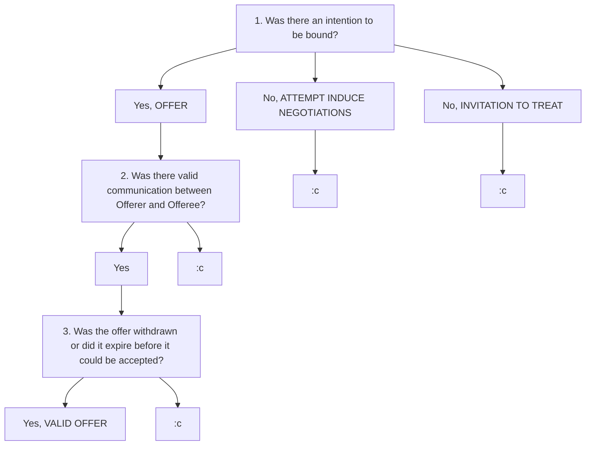

# `S1W1 Contract 1`

> **Class:** *Law 101 Contract 1*  
> **Subject:** *Intro to Contract law, Contract Formation*  
> **Lecturer:** *Prof Loo Wee Ling*  

---

## Definitions 

* Statute law: *Written law passed by a body of legislature (President, Parliment)*
    * eg. *`Electronic Transactions Act 2010 Section 14`*
* Case law: *Common law, Courts refer to past precedence and judicial authority to make current decisions (concept of Stare Decisis)*
    * eg. *`Chia Kim Huay v Saw Shu Mawa Min Min [2012]`*
* Offeror: *person making an offer*
* Offeree: *person receiving an offer*
* Estate: *people who take charge of all your assets/estate after you die*
* Contract: *Legally enforcable agreement* that need not be in writing, have a signature, or be seen via conduct
* Offer: *Legally binding contract where there is an intention by the Offeror to be bound should offer be accepted, and Offer must have been communicated to Offeree.*
* Acceptance: *A final and unqualified expression of assent to the terms of an offer.*

## Objectivity test
* Plaintiff has to determine what a reasonable person OF THE SAME `BACKGROUND` and `STATUS` *(standing in place of the defendant)* would have understood of a given incident.
* 2 APPROACHES
    1. **`Promisee objectivity approach`**
        * Consider what a reasonable person in the place of promisee might have understood the promiser to mean.
            * "*Would said reasonable person have followed the same line of reasoning or is there something felacious with the defendant's reasoning?*"  
    2. **`Promisor objectivity approach`**
        * Understand what the promisor objectively understood his promise to mean to the promisee, enforce the promise thus construed.

## Anatomy of a Contract

### 1. Formation
* Offer
* Acceptance
* Consideration of agreement
* Intention to create legal relations
* Certainity & Completeness

### 2. Scope
* Determined by terms of contract
    * Implied / Expressed
    * Liability for breach can be limited / excluded
    * 3rd Party rights
* Performance must be in accordance with the terms

### 3. Termination by **Vitiation**
* Misrepresentation
* Duress
* Undue influence
* Illegality
* Mistake, et cetera

### 4. Termination by **Discharge**
* Full performance  
* Mutual agreemenT  
* Breach  
* Frustration of basis of contract  

## About Offer and Acceptance...

### Offer
* Offer: *Legally binding contract where there is an intention by the Offeror to be bound should offer be accepted, and Offer must have been communicated to Offeree.*

### Is this even an Offer?

To determine whether something is even an offer, ask these 3 questions.

#### 1. Is there an intention to be bound?
* `Intention to be bound`
* `Offer`: Maker's proposal leads a reasonable recepient in the SAME POSITION as the RECEPIENT to believe that the maker has an intention to be bound *(ie OBJECTIVITY TEST)*
* `Invitation to treat`/`Attempt to induce negotiations`: No, proposal ONLY leads a reasonable recepient in the same position to believe that maker is attempting to induce offers.
* [Electronic Transactions Act](https://sso.agc.gov.sg/Act/ETA2010) Section 14
    * **Intention to be bound** still required even in the new age of online adverisement 

#### 2. Was the Offer validly communicated?
* Offerror validly communicated offer to the Offeree
* Offeree validly communicated acceptance (if any) to Oferror

#### 3. Ascertain if offer has been withdrawn or offer has expired before it can be accepted.

### Unilateral vs Bilateral offers

#### 1. Unilateral offer
* Performance of conditions is the ACCEPTANCE of the unilateral offer.
* It is possible to make unilateral offers to more than one person, perhaps to the entire world.
* `Carlill vs Carbolic Smokeball Company`
    * Courts applied the **objective approach** in determining whether Carbolic Smokeball Company could be held liable for Carlill's illness.

#### 2. Bilateral offer
* **Explicit exchange** of promises EXPRESSED clearly.
* Edge cases
* `Tinn v Hoffman & Co`
    * No contract could be concluded in the situation of a **cross-offer**.

### Termination of an offer

不要讲了😠

#### 1. Rejection of offer
* EXPRESSED
    * Word
    * Conduct
* IMPLIED
* Counter-offer IS NOT Request for information
    * Courts need to distinguish between the two to determine whether the original offer has been terminated

#### 2. Lapse of time
* deadline stated via EXPRESS PROVISION
    * eg. *"Offer valid for 10 more minutes"*
* Otherwise, offer expires upon EXPIRY OF REASONABLE TIME

#### 3. Failure of a condition subject to which offer was made
* EXPRESSED
* IMPLIED
    * `Financings Limited vs Stimson`

#### 4. Death
* If Offeree knows of Offeror's death, CANNOT ACCEPT
* If Offeree doesn't know of Offeror's death, law is unclear but leans toward CAN ACCEPT if contract *not for personal service*
* `Chia Kim Huay v Saw Shu Mawa Min Min [2012]`
    * Offeree's state can accept if offer is not personal to Offeree

#### 5. Withdrawing an offer
1.  **BILATERAL OFFERS**
    * Withdrawal must be initiated before ACCEPTANCE.
    * Withdrawal only VALID once Offeree is *aware of it*.
    * Can there be an implied revocation by a 3rd party related to the Offeror?
        * `Dickinson v Dodds`
            * Generally, yes, if the 3rd party is a RELIABLE SOURCE OF INFORMATION.
            * In this case, the 3rd party was the Offeree's own agent and hence there is no problem with communication.

2. **UNILATERAL OFFER**
    > Law not settled in Singapore yet!
    * Can be withdrawn before COMPLETE PERFORMANCE of acceptance of the offer.
    * `Daulia Ltd v Four Millbank Nominees Ltd` 
        * ***2-OFFER ANALYSIS***
        * Unilateral offer creates 2 OFFERS
            1. EXPRESS OFFER
                * The offer you have "expressed"
            2. IMPLIED OFFER
                * Not mentioned but nevertheless intended by the Offeror
                * If you have started the PERFORMANCE of the Act, the Offeror will not do anything to impede the completion of said Act
    * `Errington v Errington & Woods`
        * **First and principal offer** is itself acceptance of the Offeree's commencement of performance

### Acceptance
* A **final and unqualified expression** of assent to the terms of an offer.
* Consists of...
    * Intention to be bound
    * Communication to Offeror
* Forms of acceptance differs depending on whether the contract is...
    * BILATERAL: exchange of a *promise* for a *promise*
    * UNILATERAL: exchange of a *promise* for an *act*
* [Battle of the forms](https://uk.practicallaw.thomsonreuters.com/6-502-9095?transitionType=Default&contextData=(sc.Default))
    * `Gay Choon Ing at [61]-[63]`
* [Receipt Rule]()
    * Acceptance is effective ONLY when communicated to Offeror *(contract is formed only when Offeror is notified of the acceptance)*.
    * Receipt Rule applies to **instantaneous communications of acceptance**
        * `Entores v Miles Far East`
    * EXCEPTION to Receipt Rule
        1. Not necessarily a universal rule
            * `Lord Wilberforce in Brinkibon v Stahag Stahl`
        2. Offeror waives requirement of communication
            * eg. *Unilateral contract as in `Carlil`*
        3. Postal Acceptance Rule
            * Acceptance effective upon posting and not upon receipt by Offeror.
            * `Adams v Lindsell`
* CANNOT BE **acceptance by silence**
    * `Felthouse v Bindley`
        * There cannot be an acceptance by silence especially where the **condition that silence constitutes acceptance is unilaterally foisted upon the Oferee**.
    * `Foo Jong Long Dennis v Ang Yee Lim Lawrence [2016] SGHC`
        * Effect of silence is **context-dependant**
* CAN BE **acceptance by silence**
    * `Midlink Development Pte Ltd v The Stansfield Group Pte Ltd`
        * Tenant did not sign draft rental agreement but continued to pay new rent, Court found that there was an oral agreement
    * `Foo Jong Long Dennis v Ang Yee Lim Lawrence [2016] SGHC`

### Referenced readings

1. `Chwee Kin Keong and Others v. Digilandmall.com Pte Ltd [2004] 2 SLR(R) 594 at
[1], [102]-[103] and [143]-[144]`

2. `Foo Jong Long Dennis v Ang Yee Lim Lawrence and another [2016] 2 SLR 287 at
[68]-[73]`

3. `Chwee Kin Keong and Others v. Digilandmall.com Pte Ltd [2004] 2 SLR(R) 594 at
[91]-[101] – NB: the judgment referred to sections in the previous Electronic Transactions Act of 1998. Please look up the corresponding sections in the current Act of 2010.`
