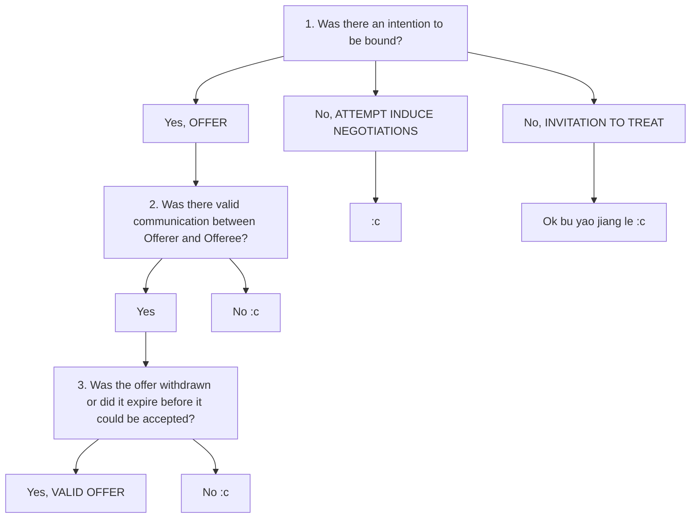

# `S1W1 Contract 1`

> **Class:** *Law 101 Contract 1*  
> **Subject:** *Intro & Contract Formation*  
> **Lecturer:** *Prof Loo Wee Ling*  

---

## Slides

`Contract`: Legally enforcable agreement
* Need not be in writing, have a signature, or be in conduct
* Formalises two-way accountability between Offerer and Offeree

> #### Statute law vs Case law
> * Statute law  
>   * Law created by the President || Parliment and enshrined in the statutes
> * Case law
>   * Common law, where courts defer to past decisions of higher courts *(stare decis)*

### `Objectivity`
* **Objective test**
    * Plaintiff has to determine what a reasonable person OF THE SAME `BACKGROUND` and `STATUS` *(standing in place of the defendant)* have had an understanding of a given incident.
    * Types of approaches
        * **`Promisee objectivity approach`**
            * Consider what a reasonable person in the place of promisee might have understood the promiser to mean.
                * "*Would said reasonable person have followed the same line of reasoning or is there something felacious with the defendant's reasoning?*"  
        * **`Promisor objectivity approach`**
            * Understand what the promisor objectively understood his promise to mean to the promisee, enforce the promise thus construed.

### Anatomy of a Contract

1. Formation
    * Offer
    * Acceptance
    * Consideration of agreement
    * Intention to create legal relations
    * Certainity & Completeness

2. Scope
    * Determined by terms of contract
        * Implied / Expressed
        * Liability for breach can be limited / excluded
        * 3rd Party rights
    * Performance must be in accordance with the terms

3. Termination by **Vitiation**
    * Misrepresentation
    * Duress
    * Undue influence
    * Illegality
    * Mistake, et cetera

4. Termination by **Discharge**
    * Full performance `c:`
    * Mutual agreemenT `c:`
    * Breach `:c`
    * Frustration of basis of contract `:c`

### Definitions 

* Offeror: *person making an offer*
* Offeree: *person receiving an offer*

### Eh is it even an Offer?

Ask these 3 questions.

1. Is there an **intention to be bound**?
    * `Offer`: Maker's proposal leads a reasonable recepient in the SAME POSITION as the RECEPIENT to believe that the maker has an intention to be bound *(ie OBJECTIVITY TEST)*
    * `Invitation to treat`: No, proposal ONLY leads a reasonable recepient in the same position to believe that maker is attempting to induce offers.
    * [Electronic Transactions Act](https://sso.agc.gov.sg/Act/ETA2010) Section 14
        * **Intention to be bound** still required even in the new age of online adverisement 
2. Was the Offer **validly communicated**?
    * Offerror validly communicated offer to the Offeree
    * Offeree validly communicated acceptance (if any) to Oferror
3. Ascertain if **offer has been withdrawn** or **offer has expired** before it can be accepted

### Talking about Offers...

* Unilateral offer
    * *Performance of conditions is the ACCEPTANCE of the unilateral offer.*
    * Acceptance of a unilaterla offer 
    * It is possible to make unilateral offers to the world
    * `Carlill vs Carbolic Smokeball Company`
        * Courts applied the **objective approach**  
* Bilateral offer
    * Explicit exchange of promises
* Edge cases
    * `Tinn v Hoffman & Co`
        * No contract could be concluded in the situation of a cross-offer

### 不要讲了😠

Termination of offer

1. **Rejection of offer**
    * EXPRESSED
        * Word
        * Conduct
    * IMPLIED
    * Counter-offer IS NOT Request for information
        * Courts need to distinguish between the two to determine whether the original offer has been terminated
2. **Lapse of time**
    * deadline stated via EXPRESS PROVISION
        * eg. *"Offer valid for 10 more minutes"*
    * Otherwise, offer expires upon EXPIRY OF REASONABLE TIME
3. **Failure of a condition** subject to which offer was made
    * EXPRESSED
    * IMPLIED
        * `Financings Limited vs Stimson`
4. Death :c
    * If Offeree knows of Offeror's death, CANNOT ACCEPT
    * If Offeree doesn't know of Offeror's death, law is unclear but leans toward CAN ACCEPT if contract *not for personal service*
    * `Chia Kim Huay v Saw Shu Mawa Min Min [2012]`
        * Offeree's state can accept if offer is not personal to Offeree

### Acceptance
* An acceptance is a final and unqualified expression of assent to the terms of an offer.

### Pls read

1. `Chwee Kin Keong and Others v. Digilandmall.com Pte Ltd [2004] 2 SLR(R) 594 at
[1], [102]-[103] and [143]-[144]`

2. `Foo Jong Long Dennis v Ang Yee Lim Lawrence and another [2016] 2 SLR 287 at
[68]-[73]`

3. `Chwee Kin Keong and Others v. Digilandmall.com Pte Ltd [2004] 2 SLR(R) 594 at
[91]-[101] – NB: the judgment referred to sections in the previous Electronic Transactions Act of 1998. Please look up the corresponding sections in the current Act of 2010.`

