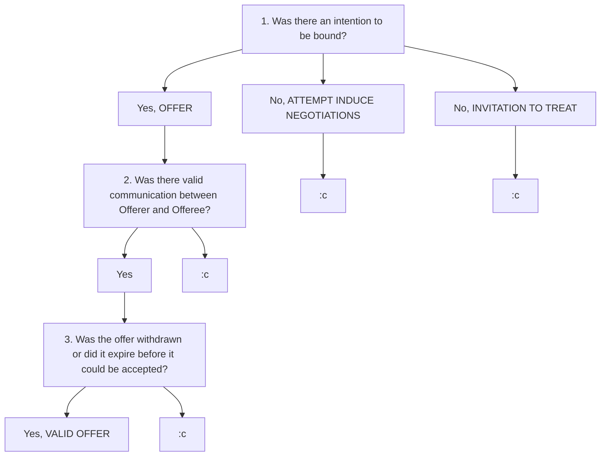

# `S1W1 Contract 1`

> **Class:** *Law 101 Contract 1*  
> **Subject:** *Intro to Contract law, Contract Formation*  
> **Lecturer:** *Prof Loo Wee Ling*  

---

## Definitions 

* Statute law: *Written law passed by the Legislature*
    * eg. *`Electronic Transactions Act 2010 Section 14`*
* Case law: *Common law, Courts refer to past precedence and judicial authority to make current decisions (concept of Stare Decisis)*
    * eg. *`Chia Kim Huay v Saw Shu Mawa Min Min [2012]`*
* Offeror: *person making an offer*
* Offeree: *person receiving an offer*
* Estate: *people who take charge of all your assets/estate after you die*
* Contract: *Legally enforcable agreement* that need not be in writing, have a signature, or be seen via conduct
* Offer: *Legally binding contract where there is an intention by the Offeror to be bound should offer be accepted, and Offer must have been communicated to Offeree.*
* Acceptance: *A final and unqualified expression of assent to the terms of an offer.*
* Battle of the Forms: Situation where 2 businesses are negotiating the terms of a contract and each party wants to contract on the basis of its own terms. The battle is often won by the party who fired the "LAST SHOT" *(the party who put forward terms and conditions that were not explicitly rejected by the recipient)*
    * UK application of the 'LAST SHOT' doctrine
        * `Butler Machine Tool`
    * Singapore's position on 'LAST SHOT' doctrine
        * `Gay Choon Ing at [61]-[63]`

## Contract law

* Note that while there are some *statutes* that relate to Contract law, due to the complexity of each case, most decisions in Contract law are arrived at using *Case law*.

> Therefore, in IRAC responses, a bulk of argumentation for Rule and Application should come from **Case law** (mentioning past cases that are of relevance), and **statutes** should be used to supplement the core argument.

## Objectivity test
* Plaintiff has to determine what a reasonable person OF THE SAME `BACKGROUND` and `STATUS` *(standing in place of the defendant)* would have understood of a given incident.
* 2 APPROACHES
    1. **`Promisee objectivity approach`**
        * Consider what a reasonable person in the place of promisee might have understood the promiser to mean.
            * "*Would said reasonable person have followed the same line of reasoning or is there something felacious with the defendant's reasoning?*"  
    2. **`Promisor objectivity approach`**
        * Understand what the promisor objectively understood his promise to mean to the promisee, enforce the promise thus construed.

## Anatomy of a Contract

### 1. Formation
* Offer
* Acceptance
* Consideration of agreement
* Intention to create legal relations
* Certainity & Completeness

### 2. Scope
* Determined by terms of contract
    * Implied / Expressed
    * Liability for breach can be limited / excluded
    * 3rd Party rights
* Performance must be in accordance with the terms

### 3. Termination by **Vitiation**
* Misrepresentation
* Duress
* Undue influence
* Illegality
* Mistake, et cetera

### 4. Termination by **Discharge**
* Full performance  
* Mutual agreemenT  
* Breach  
* Frustration of basis of contract  

## About Offer and Acceptance...

### Offer
* Offer: *Legally binding contract where there is an intention by the Offeror to be bound should offer be accepted, and Offer must have been communicated to Offeree.*

### Is this even an Offer?

To determine whether something is even an offer, ask these 3 questions.

#### 1. Is there an intention to be bound?
* `Intention to be bound`
* `Offer`: Maker's proposal leads a reasonable recepient in the SAME POSITION as the RECEPIENT to believe that the maker has an intention to be bound *(ie OBJECTIVITY TEST)*
* `Invitation to treat`/`Attempt to induce negotiations`: No, proposal ONLY leads a reasonable recepient in the same position to believe that maker is attempting to induce offers.
* [Electronic Transactions Act](https://sso.agc.gov.sg/Act/ETA2010) Section 14
    * **Intention to be bound** still required even in the new age of online adverisement 

#### 2. Was the Offer validly communicated?
* Offerror validly communicated offer to the Offeree
* Offeree validly communicated acceptance (if any) to Oferror

#### 3. Ascertain if offer has been withdrawn or offer has expired before it can be accepted.

### Unilateral vs Bilateral offers

#### 1. Unilateral offer
* Performance of conditions is the ACCEPTANCE of the unilateral offer.
* It is possible to make unilateral offers to more than one person, perhaps to the entire world.
* `Carlill vs Carbolic Smokeball Company`
    * Courts applied the **objective approach** in determining whether Carbolic Smokeball Company could be held liable for Carlill's illness.

#### 2. Bilateral offer
* **Explicit exchange** of promises EXPRESSED clearly.
* Edge cases
* `Tinn v Hoffman & Co`
    * No contract could be concluded in the situation of a **cross-offer**.

### Termination of an offer

#### 1. Rejection of offer
* EXPRESSED
    * Word
    * Conduct
* IMPLIED
* Counter-offer IS NOT Request for information
    * Courts need to distinguish between the two to determine whether the original offer has been terminated

#### 2. Lapse of time
* deadline stated via EXPRESS PROVISION
    * eg. *"Offer valid for 10 more minutes"*
* Otherwise, offer expires upon EXPIRY OF REASONABLE TIME

#### 3. Failure of a condition subject to which offer was made
* EXPRESSED
* IMPLIED
    * `Financings Limited vs Stimson`

#### 4. Death
* If Offeree knows of Offeror's death, CANNOT ACCEPT
* If Offeree doesn't know of Offeror's death, law is unclear but leans toward CAN ACCEPT if contract *not for personal service*
* `Chia Kim Huay v Saw Shu Mawa Min Min [2012]`
    * Offeree's state can accept if offer is not personal to Offeree

#### 5. Withdrawing an offer
1.  **BILATERAL OFFERS**
    * Withdrawal must be initiated before ACCEPTANCE.
    * Withdrawal only VALID once Offeree is *aware of it*.
    * Can there be an implied revocation by a 3rd party related to the Offeror?
        * `Dickinson v Dodds`
            * Generally, yes, if the 3rd party is a RELIABLE SOURCE OF INFORMATION.
            * In this case, the 3rd party was the Offeree's own agent and hence there is no problem with communication.

2. **UNILATERAL OFFER**
    > Law not settled in Singapore yet!
    * Can be withdrawn before COMPLETE PERFORMANCE of acceptance of the offer.
    * `Daulia Ltd v Four Millbank Nominees Ltd` 
        * ***2-OFFER ANALYSIS***
        * Unilateral offer creates 2 OFFERS
            1. EXPRESS OFFER
                * The offer you have "expressed"
            2. IMPLIED OFFER
                * Not mentioned but nevertheless intended by the Offeror
                * If you have started the PERFORMANCE of the Act, the Offeror will not do anything to impede the completion of said Act
    * `Errington v Errington & Woods`
        * **First and principal offer** is itself acceptance of the Offeree's commencement of performance

### Acceptance
* Acceptance: A **final and unqualified expression** of assent to the terms of an offer.

### Elements of Acceptance
#### 1. INTENTION TO BE BOUND determined OBJECTIVELY
* 'Intention to be bound' evaluated as by means of final and unqualified assent to the terms of the offer
* 'Objectively' determined via Objectivity test
    * **OBJECTIVITY TEST**: 
        * Take point of view of a reasonable person standing in the shoes of the offeror

#### 2. COMMUNICATION TO OFFEROR
##### General Receipt Rule (communication rule)
* Acceptance effective upon communication TO **offeror**. Contract is only formed when **offeror** is notified of acceptance.
* Applies for face-to-face communication, Fax, Telephone, Emails
    1. `Entores v Miles Far East`
        * Case Summary:
            > ADD CASE SUMMARY and court ruling HERE
        * Court Ruling:
            * General Rule applies to **INSTANTANEOUS COMMUNICATION** 

##### EXCEPTIONS to General Receipt Rule
1. **Lord Wilberforce's 3 factors** 
    1. Intention of the parties
    2. Sound business practice
    3. Making a judgement on where the risks should lie
    * *"No universal rule can cover all such cases; they must be resolved by reference to the intentions of the parties, by sound business practice and in some cases by a judgment where the risks should lie"*
    * `Brinkibon v Stahag Stahl`
        * Case Summary:
            > ADD CASE SUMMARY HERE
        * Court Ruling:
            > ADD COURT RULING HERE
2. **POSTAL ACCEPTANCE RULE** 
    1. Applies when letter is properly stamped and addressed
    2. Use of Post to accept offers has been authorised, EXPRESSLY or IMPLICITLY
    * `Adams v Lindsell`
        * Case Summary:
            > ADD CASE SUMMARY and court ruling HERE
        * Court Ruling: 
            * *"considerable delay in commercial transactions ... for the acceptor would never be entirely safe in acting upon his acceptance until he had received notice that his letter of acceptance had reached its destination"*
3. **OFFEROR WAIVES REQUIREMENT OF COMMUNICATION**
    * Unilateral contracts as in `Carlil v Carbolic Smokeball Company`

### Forms of acceptance

Forms of acceptance differs depend on whether the contract is...
#### BILATERAL offer
* Exchange of a *promise* for a *promise*

#### UNILATERAL offer
* Exchange of a *promise* for an *act*

#### Acceptance by silence
##### CANNOT BE **acceptance by silence**
* `Felthouse v Bindley`
    * There cannot be an acceptance by silence especially where the **condition that silence constitutes acceptance is unilaterally foisted upon the Oferee**.
* `Foo Jong Long Dennis v Ang Yee Lim Lawrence [2016] SGHC`
    * Effect of silence is **context-dependant**
##### CAN BE **acceptance by silence**
* `Midlink Development Pte Ltd v The Stansfield Group Pte Ltd`
    * Tenant did not sign draft rental agreement but continued to pay new rent, Court found that there was an oral agreement
* `Foo Jong Long Dennis v Ang Yee Lim Lawrence [2016] SGHC`

### [Electronic Transactions](https://sso.agc.gov.sg/Act/ETA2010)

For all things relating to electronic contracts in Singapore, refer to the Electronic Transactions act. Specifically, see...
#### Section 2 ETA

* Electronic communications: 
* Electronic record:

> * Add the following here: see definitions of “electronic communications” and “electronic record”  
> * Do the rules on formation of contract (offer & acceptance) apply to transactions carried on through electronic means?  

#### Section 11(1) ETA

* *"For the avoidance of doubt, it is declared that in the context of the formation of contracts, an offer and the acceptance of an offer may be expressed by means of electronic communications"*

#### Section 13(1) ETA

* The TIME OF DESPATCH of an electronic communication is: 
    * the time when it **leaves an information system** under the
control of the originator 
    * if the electronic communication has not left an information system under the control of the originator..., the time when the **electronic communication is received**

#### Section 13(2) ETA

* The time of receipt of an electronic communication is the time when [it] becomes capable of being retrieved by the addressee at an electronic address designated by the addressee.

#### Section 13(3) ETA

* The time of receipt of an electronic communication at an electronic address that has not been designated by the addressee is the time when [it] becomes capable of being retrieved by the addressee at that address & the addressee becomes aware that [it] has been sent to that address.

#### Section 13(4) ETA

* For ... [s 13(2) and (3)], electronic communication is presumed to be capable of being retrieved by addressee when it reaches the electronic address of the addressee.

* Allows contracting parties to...
    * exclude the application of s13 (among other provisions)
    * vary the effect of s13 (among other provisions
