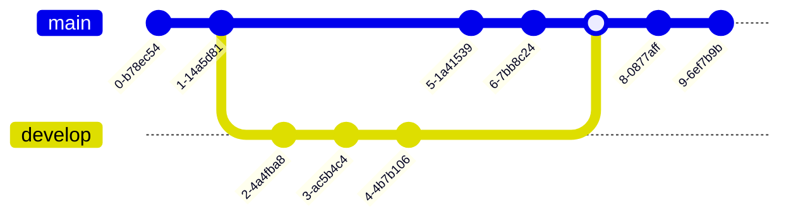

# `Mermaid` 🧜‍♀️📈


<h2 align="center">What is Mermaid?</h2>

Mermaid is a **diagramming** and **charting tool** that renders *dynamic diagrams* in markdown-style fenced `code blocks`.

<h2 align="center">Demonstration</h2>

This is what a simple basic block of mermaid code looks like when writing it.

* `mermaid` declares a block of ***mermaid code***.

````

````

And this is what it renders to in a Markdown *(`.md`)* document.


Mermaid is capable of <u>**a lot more**</u> than this as well, which we'll come to see below.

<h2 align="center">Types of Mermaid graphs</h2>

### [Flowchart](https://mermaid.js.org/syntax/flowchart.html?id=flowcharts-basic-syntax)

As displayed earlier, the most basic Mermaid diagram is the **flowchart**, but it can be used to create very expressive diagrams.

#### Syntax 

* `flowchart` indicates to Mermaid that this is a <u>**flowchart diagram**</u>.
* `LR` / `TD` / `BT` / `RL` specify whether the diagram displays **left to right**, **top down**, **bottom to top**, or **right to left**.
* `-->` creates an ***arrowhead*** that separates each node on the flowchart, and indicates the *relationship shared between nodes*.
* `---` creates an ***open link***.
* `-.->` creates a ***dotted link***.
* `==>` creates a ***thick link***.
* `~~~` creates an ***invisible link***.
* `--o` / `--x` create different ***arrow types***.
* `&` indicates multiple relationships.
* `id` prefixes any nodes that have names which *contain spaces*, or are *enclosed in a unique shape*.
* `--{text}-->` creates text in an arrowhead.
* Multi-directional arrows can also be created in the style of `<-->`.

#### Example 1

###### Markdown code:

````

````

###### Diagram rendered:


#### Example 2

###### Markdown code:

````

````

###### Diagram rendered:


---

### [State diagram](https://mermaid.js.org/syntax/stateDiagram.html)

**State diagrams** describe the behaviour of components within a system. Syntax-wise, they share a great deal with flowcharts.

#### Syntax

* `stateDiagram-v2` indicates to Mermaid that this is a <u>**state diagram**</u>.
* `[*]` represents a starting or ending node, displayed as a circle.
* `:` add a transition in between two states.

#### Example 1

###### Markdown code:

````

````

###### Diagram rendered:


#### Example 2

###### Markdown code:

````

````

###### Diagram rendered:


#### Example 3

###### Markdown code:

````

````

###### Diagram rendered:


---

### [Pie Chart](https://mermaid.js.org/syntax/pie.html)

**Pie charts** have a ridiculously simple Mermaid syntax.

#### Syntax

* `pie` indicates to Mermaid that this is a <u>**pie chart diagram**</u>.
* `title` allows us to specify a title for the **pie chart**.
* `showData` renders the data values in the legend.
* Components are surrounded by `""` *(double quotation marks)*, and `:` *(double colons)* deliniate the **quantity** *(positive numeric value)* of each component.

#### Example 1

````

````


---

### [Git graphs](https://mermaid.js.org/syntax/gitgraph.html)

**Git graphs** display a history of git commits and git actions on various branches.

#### Syntax

* `gitGraph` indicates to Mermaid that this is a <u>**git graph**</u>.
* `commit` representes a **new commit** on the <u>current branch</u>.
    * `commit id` assigns the current commit a **custon name** specified by us.
    * `type` assigns a different display for a given commit depending on whether it is `NORMAL`, `REVERSE` or `HIGHLIGHT`.
    * `tag` assigns a tag to a given commit.
* `branch` represents the **creation of** and **switching to** a new branch, **setting it as the current branch**.
* `checkout` represents the **checking out of** the existing branch, and **setting it as the current branch**.
* `merge` represents the **merging** of an existing branch onto the current branch.

#### Example 1

###### Markdown code:

````

````

###### Diagram rendered:



---

### [User journey diagram](https://mermaid.js.org/syntax/userJourney.html)

**User journey diagrams** are relatively self-explanatory, and are useful for visually detailing a specific workflow.

#### Syntax

* `journey` indicates to Mermaid that this is a <u>**user journey diagram**</u>.
* `section` creates a general header group that details actions taken during a set period of time.

#### Example 1

###### Markdown code:

````

````

###### Diagram rendered:


---

### [Class diagram](https://mermaid.js.org/syntax/classDiagram.html)

**Class diagrams** display the structure of a system, detailing the respective classes, their attributes and methods, as well as the relationship between said objects.

#### Syntax

* `classDiagram` indicates to Mermaid that this is a <u>**class diagram**</u>.
* For remaining syntax, refer to [this link](https://mermaid.js.org/syntax/classDiagram.html).

#### Example 1

###### Markdown code:

````

````

###### Diagram rendered:


---

### [Sequence diagram](https://mermaid.js.org/syntax/sequenceDiagram.html)

**Sequence diagrams** display interactions that occur in a specified order.

#### Syntax

* `sequenceDiagram` indicates to Mermaid that this is a <u>**sequence diagram**</u>.
* `participants` prefixes the name of all participants in the diagram.
* `actor` prefixes the name of all participants in the diagram, and displays a human figure instead of a box with the name.
    * `as` assigns an alias to a participant or actor *(in the format of `participant A as Alice`).
* `box` and `& ` segregates multiple sequence diagrams.
* `->` / `-->` / `->>` / `-->>` / `-x` / `--x` / `-)` / `--)` all render arrows of different types.
* `activate` / `+` activates an actor for a specified period.
* `deactivate` / `-` deactivates an actor for a specified period.
* `loop` and `end` create a **loop** over a given interaction.
* `alt` / `opt` / `par` / `critical` denote **alternate** / **optional** / **parallel** / **critical** interactions.
* `Note` syntax is similar as in state diagrams.

#### Example 1

###### Markdown code:

````
```mermaid
sequenceDiagram
    actor Alice
    actor Bob
    Alice->>Bob: Hi Bob
    Bob->>Alice: Hi Alice
```
````

###### Diagram rendered:

```mermaid
sequenceDiagram
    actor Alice
    actor Bob
    Alice->>Bob: Hi Bob
    Bob->>Alice: Hi Alice
```

#### Example 2

###### Markdown code:

````
```mermaid
sequenceDiagram
    Alice->John: Hello John, how are you?
    loop Every minute
        John-->Alice: Great!
    end
```
````

###### Diagram rendered:

```mermaid
sequenceDiagram
    Alice->John: Hello John, how are you?
    loop Every minute
        John-->Alice: Great!
    end
```

#### Example 3

###### Markdown code:

````
```mermaid
sequenceDiagram
    par Alice to Bob
        Alice->>Bob: Go help John
    and Alice to John
        Alice->>John: I want this done today
        par John to Charlie
            John->>Charlie: Can we do this today?
        and John to Diana
            John->>Diana: Can you help us today?
        end
    end
```
````

###### Diagram rendered:

```mermaid
sequenceDiagram
    par Alice to Bob
        Alice->>Bob: Go help John
    and Alice to John
        Alice->>John: I want this done today
        par John to Charlie
            John->>Charlie: Can we do this today?
        and John to Diana
            John->>Diana: Can you help us today?
        end
    end
```

---

### [Mindmap](https://mermaid.js.org/syntax/mindmap.html)

* Expressing interconnected ideas fluidly

---

### [Requirement diagram](https://mermaid.js.org/syntax/requirementDiagram.html)

* Events or components with multiple dependancies

---

### [Timeline](https://mermaid.js.org/syntax/timeline.html)

* Concurrent timeline of multiple events

---

### [Gantt diagrams](https://mermaid.js.org/syntax/gantt.html)

* Project management in a team
* Timeline

---

### [Entity relationship diagram](https://mermaid.js.org/syntax/entityRelationshipDiagram.html)

* Interrelated nodes of interest in a scenario, domain of knowledege

---

<h2 align="center">Resources</h2>

> Mermaid live editor is available [here](https://mermaid.live/).
