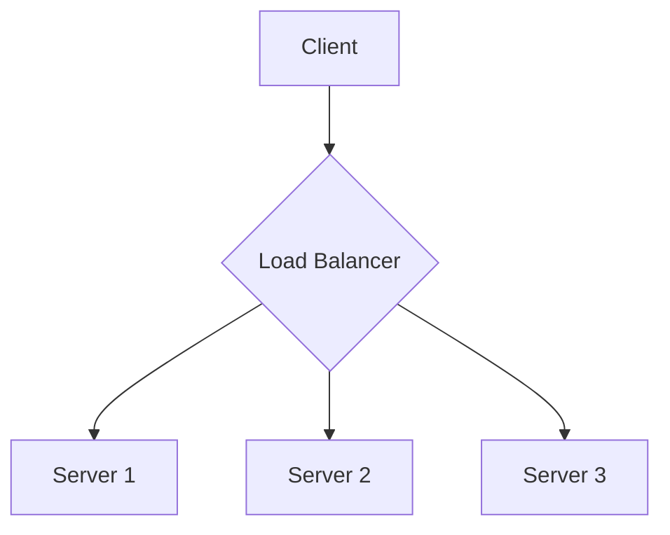
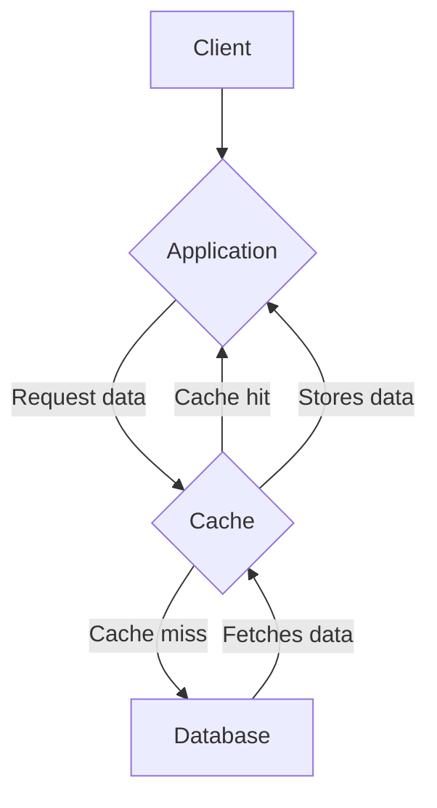
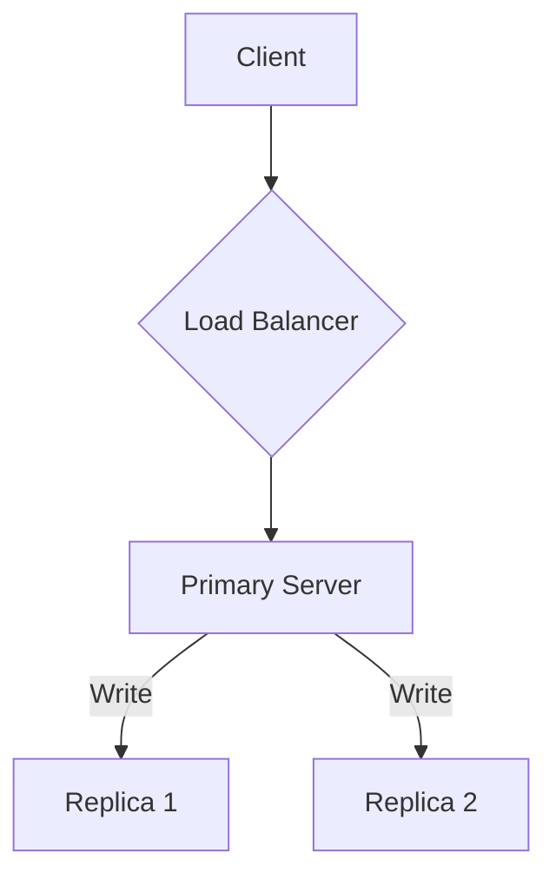
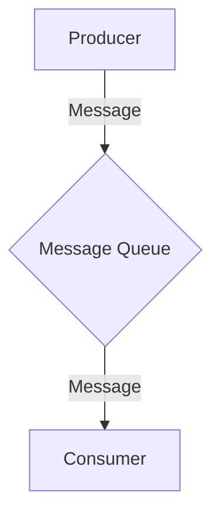
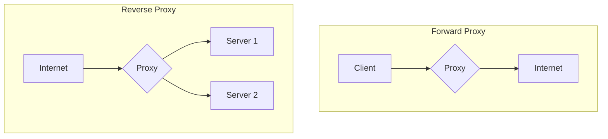
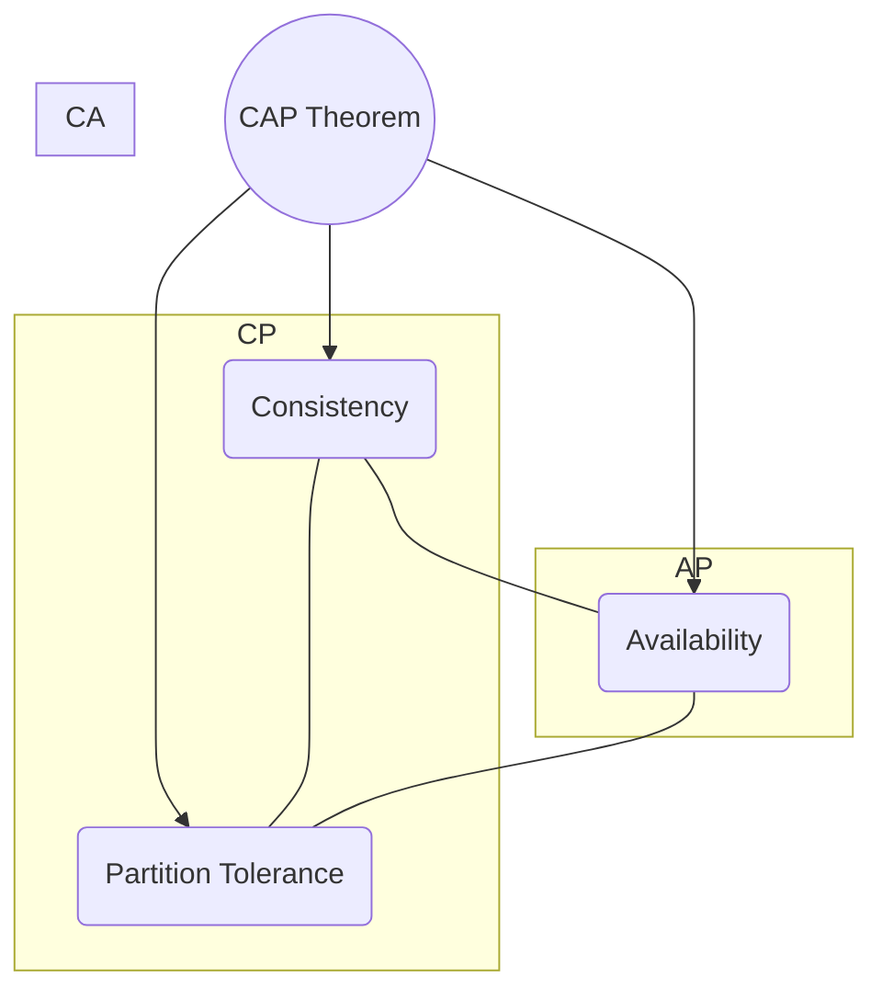

# `System Design Patterns`

An overview of common patterns used in system design interviews and real-world applications.

## Introduction to System Design

System design is the process of defining the architecture, components, modules, interfaces, and data for a system to satisfy specified requirements. It is a crucial skill for software engineers, especially in the context of scalable and reliable applications.

## Load Balancing

Load balancing is the process of distributing network traffic across multiple servers to ensure that no single server becomes overwhelmed. This improves responsiveness and availability of applications.



### Common Load Balancing Algorithms
*   **Round Robin:** Distributes requests sequentially across the group of servers.
*   **Least Connections:** Sends traffic to the server with the fewest active connections.
*   **IP Hash:** The IP address of the client is used to determine which server receives the request.

## Caching

Caching is a technique used to store copies of files or data in a temporary storage location (cache) so that they can be accessed more quickly.



### Caching Strategies
*   **Cache-Aside:** The application is responsible for reading and writing from the cache.
*   **Read-Through:** The cache is responsible for reading data from the database on a cache miss.
*   **Write-Through:** Data is written to the cache and the database at the same time.
*   **Write-Back:** Data is written to the cache, which then asynchronously writes it to the database.

## Sharding (Partitioning)

Sharding is the process of breaking up a large database into smaller, more manageable pieces called shards. Each shard is a separate database, and all shards together make up the original database.

```mermaid
graph TD
    A[Application] --> B{Sharding Logic};
    B -- User 1 --> C[Shard 1 (A-M)];
    B -- User 2 --> D[Shard 2 (N-Z)];
```

### Sharding Strategies
*   **Horizontal Sharding:** Puts different rows into different tables.
*   **Vertical Sharding:** Divides a table into multiple tables that contain fewer columns.
*   **Directory-Based Sharding:** A lookup service is used to determine which shard holds the data.

## Replication and Redundancy

Replication is the process of creating and maintaining multiple copies of a database to improve availability and durability. Redundancy is the duplication of critical components of a system with the intention of increasing reliability.



## Message Queues

Message queues are a form of asynchronous service-to-service communication used in serverless and microservices architectures. Messages are stored on the queue until they are processed and deleted.



## Proxy Servers

A proxy server acts as an intermediary for requests from clients seeking resources from other servers.



### Forward vs. Reverse Proxy
*   **Forward Proxy:** Acts on behalf of a client (or a group of clients).
*   **Reverse Proxy:** Acts on behalf of a server (or a group of servers).

## CAP Theorem

The CAP theorem states that it is impossible for a distributed data store to simultaneously provide more than two out of the following three guarantees: Consistency, Availability, and Partition Tolerance.



## More on

* [System Design Primer on GitHub](https://github.com/donnemartin/system-design-primer)
* [System Design Interview Questions](https://www.educative.io/collection/5668639273943040/5649050225344512)
* [Grokking the System Design Interview](https://www.educative.io/courses/grokking-the-system-design-interview)
